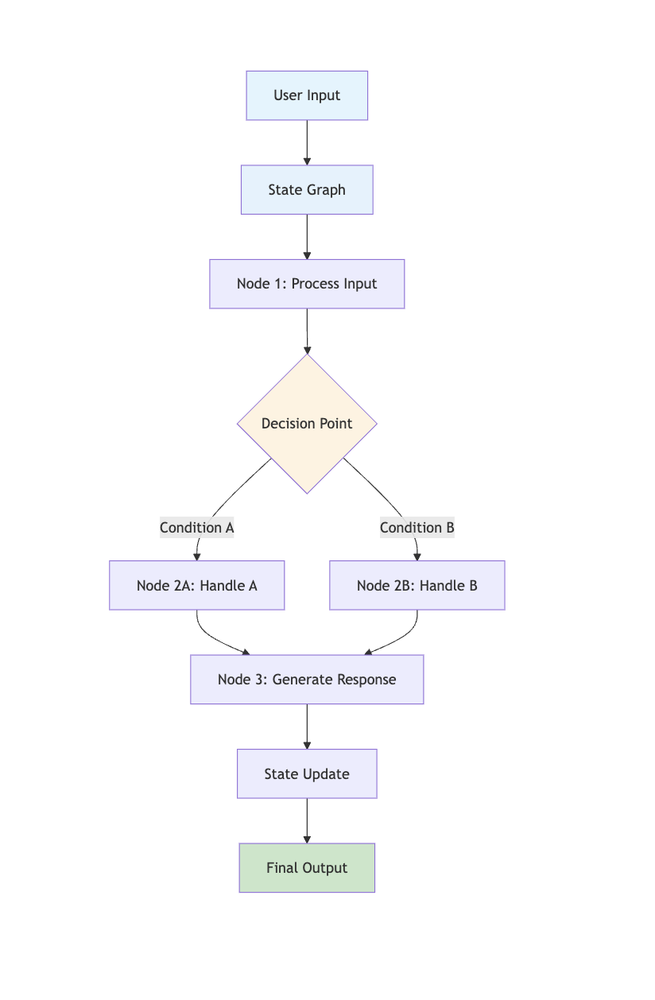
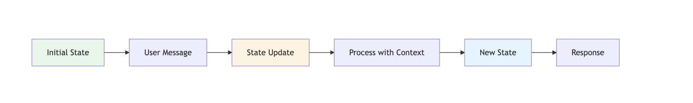
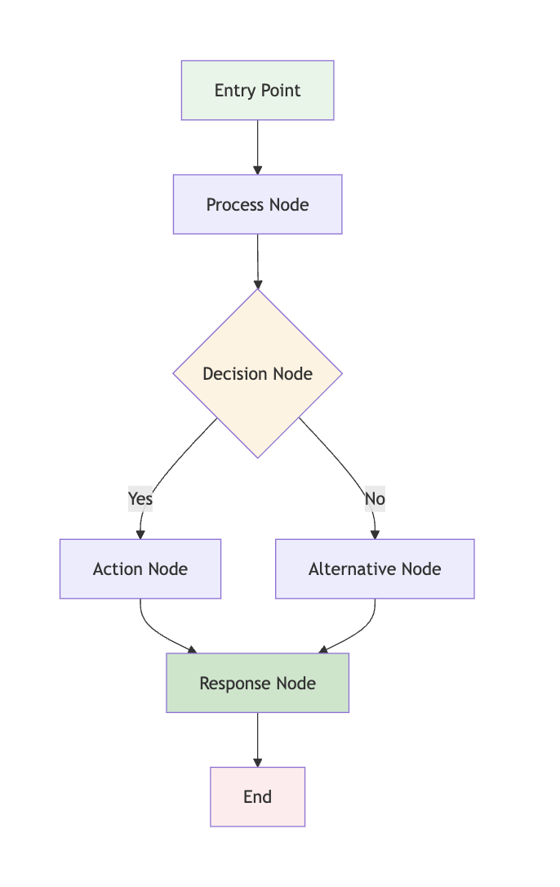
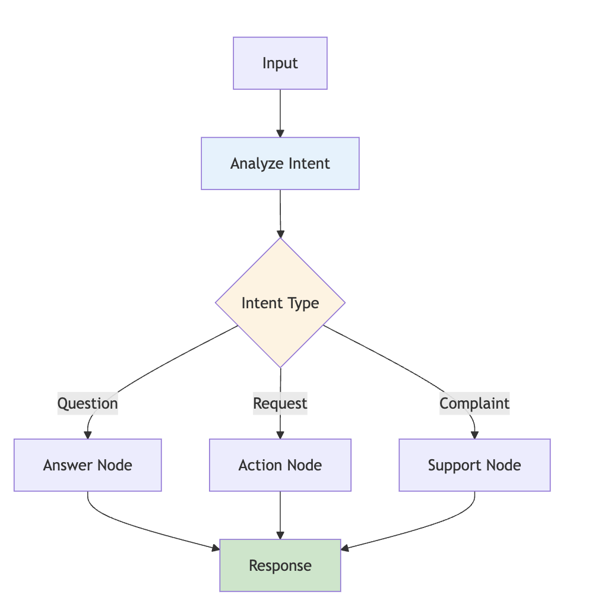
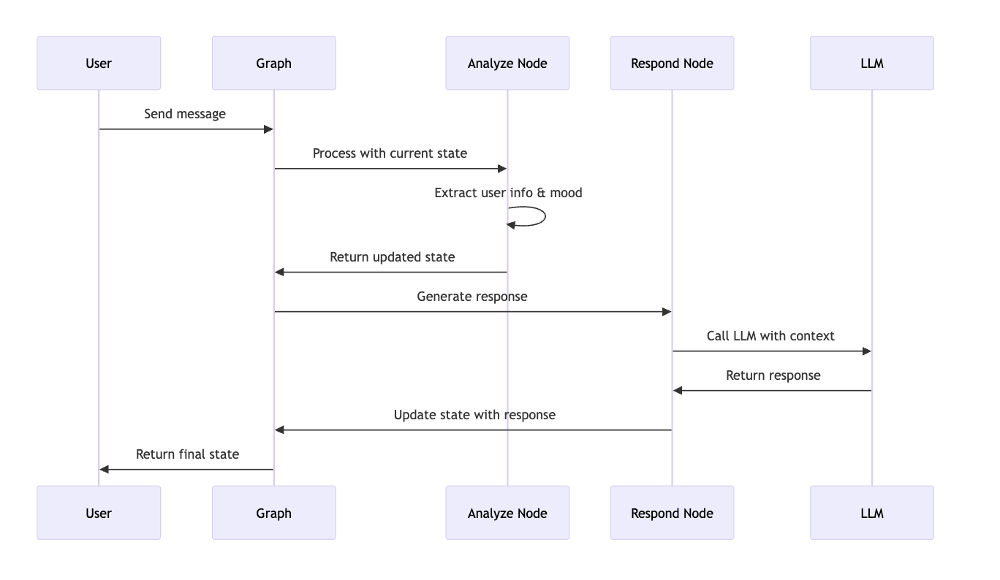

# Introduction to LangGraph

## What is LangGraph?

LangGraph is a library for building stateful, multi-actor applications with LLMs. It extends the LangChain ecosystem by providing a framework for creating complex workflows that can handle state management, conditional logic, and multi-agent interactions.

### Why LangGraph?

Traditional LangChain applications are often limited to linear chains of operations. LangGraph introduces the concept of **stateful workflows** that can:

- **Maintain context** across multiple interactions
- **Make dynamic decisions** based on current state
- **Handle complex branching logic** 
- **Support multiple specialized agents** working together
- **Provide human-in-the-loop capabilities**

### Core Architecture



## Key Concepts Explained

### 1. State Management

**State** is the backbone of LangGraph applications. Unlike traditional stateless APIs, LangGraph maintains persistent state throughout the conversation.



**Why State Matters:**
- **Context Preservation**: Remember previous interactions
- **Personalization**: Adapt responses based on user history
- **Complex Workflows**: Build multi-step processes
- **Error Recovery**: Resume from where you left off

### 2. Nodes and Edges

**Nodes** are functions that perform specific tasks, while **Edges** define how data flows between nodes.



**Node Types:**
- **Processing Nodes**: Transform data or call LLMs
- **Decision Nodes**: Make routing decisions
- **Tool Nodes**: Execute external functions
- **Response Nodes**: Format final outputs

### 3. Conditional Logic

LangGraph supports dynamic routing based on the current state, enabling intelligent workflows.



## Prerequisites

Before starting with LangGraph, ensure you have the following installed:

```bash
# Core LangGraph and LangChain
pip install -U langgraph langchain-community langchain-anthropic

# Additional dependencies for examples
pip install tavily-python pandas openai

# Optional: For advanced features
pip install sqlite3 requests numpy
```

## Environment Setup

Set up your API keys securely:

```python
import getpass
import os

def _set_env(var: str):
    """Securely set environment variables."""
    if not os.environ.get(var):
        os.environ[var] = getpass.getpass(f"{var}: ")

# Required API keys
_set_env("ANTHROPIC_API_KEY")  # For Claude models
_set_env("OPENAI_API_KEY")     # For GPT models (alternative)
_set_env("TAVILY_API_KEY")     # For web search (optional)
```

## Your First LangGraph Application

Let's build a simple but powerful chat bot that maintains conversation state.

### Step 1: Define the State

```python
from typing import TypedDict, Annotated, List
from langchain_core.messages import BaseMessage

class ChatState(TypedDict):
    messages: Annotated[List[BaseMessage], "The conversation messages"]
    user_name: Annotated[str, "User's name for personalization"]
    conversation_count: Annotated[int, "Number of messages exchanged"]
    user_mood: Annotated[str, "Detected user mood"]
    topics_discussed: Annotated[List[str], "Topics covered in conversation"]
```

**State Explanation:**
- `messages`: Stores the conversation history
- `user_name`: Enables personalized responses
- `conversation_count`: Tracks interaction frequency
- `user_mood`: Allows emotional intelligence
- `topics_discussed`: Prevents repetition

### Step 2: Create the LLM

```python
from langchain_anthropic import ChatAnthropic

# Create the LLM with specific configuration
llm = ChatAnthropic(
    model="claude-3-sonnet-20240229",
    temperature=0.7,  # Balanced creativity and consistency
    max_tokens=1000   # Reasonable response length
)
```

### Step 3: Define Node Functions

```python
from langchain_core.messages import HumanMessage, AIMessage
import re

def analyze_user_input(state: ChatState) -> ChatState:
    """Analyze user input to extract information and determine mood."""
    messages = state["messages"]
    last_message = messages[-1].content.lower()
    
    # Extract user name if mentioned
    user_name = state["user_name"]
    if "my name is" in last_message:
        name_match = re.search(r"my name is (\w+)", last_message)
        if name_match:
            user_name = name_match.group(1)
    
    # Simple mood detection
    positive_words = ["happy", "good", "great", "excellent", "wonderful"]
    negative_words = ["sad", "bad", "terrible", "awful", "angry"]
    
    mood = "neutral"
    if any(word in last_message for word in positive_words):
        mood = "positive"
    elif any(word in last_message for word in negative_words):
        mood = "negative"
    
    # Extract topics
    topics = state["topics_discussed"]
    topic_keywords = ["weather", "work", "family", "hobby", "travel"]
    for keyword in topic_keywords:
        if keyword in last_message and keyword not in topics:
            topics.append(keyword)
    
    return {
        **state,
        "user_name": user_name,
        "user_mood": mood,
        "topics_discussed": topics,
        "conversation_count": state["conversation_count"] + 1
    }

def generate_response(state: ChatState) -> ChatState:
    """Generate a contextual response based on the current state."""
    messages = state["messages"]
    user_name = state["user_name"]
    mood = state["user_mood"]
    topics = state["topics_discussed"]
    count = state["conversation_count"]
    
    # Create context-aware system prompt
    system_prompt = f"""
    You are a friendly AI assistant having a conversation with {user_name}.
    
    Current context:
    - User mood: {mood}
    - Topics discussed: {', '.join(topics) if topics else 'None yet'}
    - Message count: {count}
    
    Guidelines:
    - Be personal and use their name when appropriate
    - Match their mood (be empathetic if they're sad, enthusiastic if they're happy)
    - Avoid repeating topics they've already discussed
    - Keep responses conversational and engaging
    """
    
    # Generate response
    response = llm.invoke([{"role": "system", "content": system_prompt}] + messages)
    
    return {
        **state,
        "messages": messages + [response]
    }
```

### Step 4: Create the Graph

```python
from langgraph.graph import StateGraph, END

def create_chat_graph():
    """Create the chat bot workflow graph."""
    workflow = StateGraph(ChatState)
    
    # Add nodes
    workflow.add_node("analyze", analyze_user_input)
    workflow.add_node("respond", generate_response)
    
    # Set entry point
    workflow.set_entry_point("analyze")
    
    # Add edges (sequential flow)
    workflow.add_edge("analyze", "respond")
    workflow.add_edge("respond", END)
    
    return workflow.compile()

# Create the application
app = create_chat_graph()
```

### Step 5: Use the Application

```python
# Initialize state
initial_state = {
    "messages": [HumanMessage(content="Hi! My name is Alice and I'm feeling great today!")],
    "user_name": "User",
    "conversation_count": 0,
    "user_mood": "neutral",
    "topics_discussed": []
}

# Run the application
result = app.invoke(initial_state)

# Display results
print("=== Conversation Summary ===")
print(f"User: {result['user_name']}")
print(f"Mood: {result['user_mood']}")
print(f"Topics: {', '.join(result['topics_discussed'])}")
print(f"Messages: {result['conversation_count']}")
print(f"Last Response: {result['messages'][-1].content}")
```

## Interactive Exercises

### Exercise 1: Enhanced Mood Detection

**Challenge**: Improve the mood detection to handle more complex emotions.

<details>
<summary>Starter Code</summary>

```python
def enhanced_mood_detection(text: str) -> str:
    """Enhanced mood detection with more emotions."""
    text_lower = text.lower()
    
    # Define emotion patterns
    emotions = {
        "excited": ["excited", "thrilled", "amazing", "fantastic"],
        "happy": ["happy", "good", "great", "wonderful", "joy"],
        "calm": ["calm", "peaceful", "relaxed", "content"],
        "sad": ["sad", "depressed", "down", "blue", "miserable"],
        "angry": ["angry", "mad", "furious", "annoyed", "frustrated"],
        "anxious": ["anxious", "worried", "nervous", "stressed"]
    }
    
    # Count emotion words
    emotion_scores = {}
    for emotion, words in emotions.items():
        score = sum(1 for word in words if word in text_lower)
        if score > 0:
            emotion_scores[emotion] = score
    
    # Return the most frequent emotion
    if emotion_scores:
        return max(emotion_scores, key=emotion_scores.get)
    return "neutral"
```
</details>

### Exercise 2: Topic Tracking

**Challenge**: Add intelligent topic tracking that can identify and categorize conversation topics.

<details>
<summary>Solution</summary>

```python
def extract_topics(text: str) -> List[str]:
    """Extract and categorize topics from text."""
    text_lower = text.lower()
    
    # Define topic categories
    topic_patterns = {
        "work": ["work", "job", "office", "meeting", "project"],
        "family": ["family", "kids", "children", "parents", "spouse"],
        "hobbies": ["hobby", "sport", "music", "reading", "cooking"],
        "travel": ["travel", "vacation", "trip", "destination"],
        "health": ["health", "exercise", "diet", "doctor", "fitness"],
        "technology": ["computer", "phone", "app", "software", "tech"]
    }
    
    found_topics = []
    for topic, keywords in topic_patterns.items():
        if any(keyword in text_lower for keyword in keywords):
            found_topics.append(topic)
    
    return found_topics
```
</details>

### Exercise 3: Conversation Memory

**Challenge**: Add a memory system that can recall previous conversations and reference them.

<details>
<summary>Advanced Solution</summary>

```python
class ConversationMemory:
    def __init__(self):
        self.memory = {}
    
    def store_conversation(self, user_id: str, conversation_data: dict):
        """Store conversation data for a user."""
        if user_id not in self.memory:
            self.memory[user_id] = []
        self.memory[user_id].append(conversation_data)
    
    def get_user_history(self, user_id: str) -> List[dict]:
        """Get conversation history for a user."""
        return self.memory.get(user_id, [])
    
    def find_similar_conversations(self, user_id: str, current_topic: str) -> List[dict]:
        """Find similar past conversations."""
        history = self.get_user_history(user_id)
        similar = []
        for conv in history:
            if current_topic in conv.get('topics', []):
                similar.append(conv)
        return similar

# Usage in your state
memory = ConversationMemory()

def enhanced_analyze_node(state: ChatState) -> ChatState:
    """Enhanced analysis with memory."""
    # ... existing analysis code ...
    
    # Store conversation data
    conv_data = {
        'timestamp': datetime.now(),
        'mood': state['user_mood'],
        'topics': state['topics_discussed'],
        'message_count': state['conversation_count']
    }
    memory.store_conversation(state['user_name'], conv_data)
    
    return state
```
</details>

## Step-by-Step Walkthrough

Let's trace through what happens when a user sends a message:



**Detailed Flow:**
1. **User Input**: "Hi! My name is Alice and I'm feeling great today!"
2. **State Initialization**: Create initial state with the message
3. **Analyze Node**: Extract "Alice" as name, detect "great" mood
4. **State Update**: Update user_name, user_mood, conversation_count
5. **Respond Node**: Generate personalized response using context
6. **LLM Call**: Send system prompt + conversation to Claude
7. **Response**: Get contextual, personalized response
8. **Final State**: Return complete updated state

## Key Takeaways

### What You've Learned
- **State Management**: How to maintain persistent conversation context
- **Node Functions**: How to create processing functions that transform state
- **Graph Construction**: How to connect nodes with edges
- **Context Awareness**: How to use state information for better responses

### Next Steps
- **Tools and State Management**: Learn to build custom tools and advanced state patterns
- **Conditional Logic**: Add dynamic routing based on content and context
- **Multi-Agent Systems**: Create specialized agents for different tasks

### Best Practices
- **Keep state minimal**: Only store what you need
- **Use descriptive names**: Make your state fields self-documenting
- **Validate state**: Ensure data integrity at each step
- **Test incrementally**: Build and test each node separately

## Troubleshooting

### Common Issues

**Issue**: "StateGraph expects TypedDict"
- **Solution**: Ensure your state class inherits from `TypedDict` and uses `Annotated` for field descriptions

**Issue**: "Node function must return state"
- **Solution**: Always return the complete state object, even if you only modify some fields

**Issue**: "LLM not responding"
- **Solution**: Check your API keys and ensure the LLM is properly configured

### Debugging Tips

```python
# Add debugging to your nodes
def debug_node(state: ChatState) -> ChatState:
    print(f"Current state: {state}")
    # ... your processing logic ...
    print(f"Updated state: {state}")
    return state
```

## Try It Yourself!

**Interactive Challenge**: Build a simple calculator bot that:
1. Remembers the user's calculation history
2. Detects mathematical operations in natural language
3. Provides step-by-step explanations
4. Suggests related calculations

<details>
<summary>Starter Template</summary>

```python
class CalculatorState(TypedDict):
    messages: Annotated[List[BaseMessage], "Conversation messages"]
    calculation_history: Annotated[List[str], "Previous calculations"]
    user_preference: Annotated[str, "User's preferred calculation style"]
    next: Annotated[str, "Next action"]

def parse_calculation(state: CalculatorState) -> CalculatorState:
    """Parse mathematical expressions from user input."""
    # Your code here
    pass

def calculate_result(state: CalculatorState) -> CalculatorState:
    """Perform the calculation and explain the steps."""
    # Your code here
    pass
```
</details>

---

**Ready for the next level?** Continue to [Tools and State Management](./02-tools-and-state.md) to learn how to build custom tools and manage complex state patterns! 