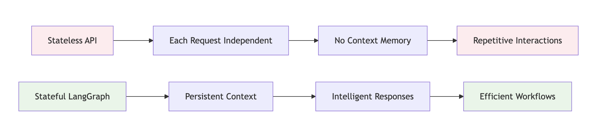
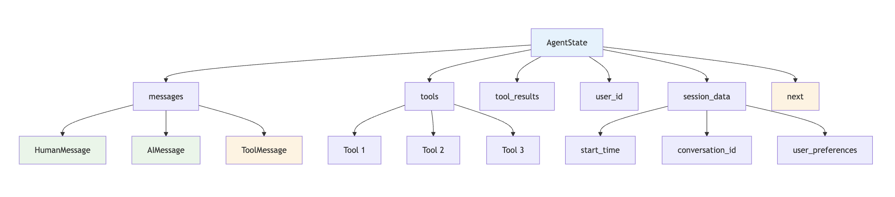
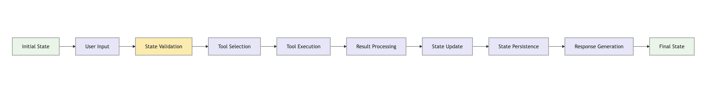
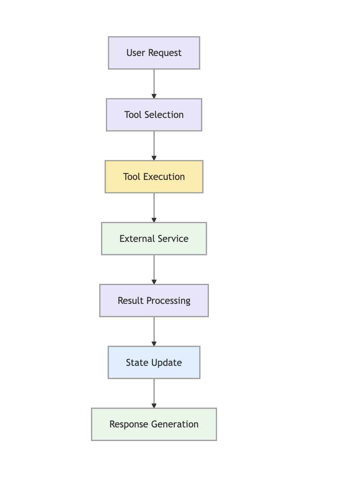
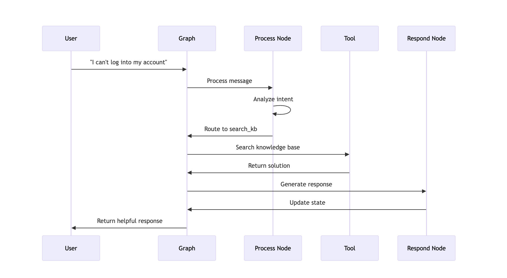

# Tools and State Management in LangGraph

## Understanding State in LangGraph

State is the backbone of LangGraph applications. It persists data throughout the execution of your graph and allows nodes to access and modify information as needed.

### Why State Management Matters



**Traditional Stateless APIs:**
- No memory between requests
- Repetitive information gathering
- No personalization
- Limited workflow complexity

**LangGraph Stateful Applications:**
- Persistent conversation context
- Intelligent, personalized responses
- Complex multi-step workflows
- Efficient resource usage

## Theoretical Foundation: State Management Concepts

### State as a Data Container

In LangGraph, state is more than just variables—it's a structured data container that flows through your entire application. Think of it as a "memory bank" that each node can read from and write to.

**Key Concepts:**
- **Immutability**: Each node receives a copy of the state and returns a new version
- **Type Safety**: Using TypedDict ensures compile-time validation
- **Persistence**: State can be saved, loaded, and restored across sessions
- **Composition**: Complex state can be built from simpler components

### State Design Patterns

**1. Flat State Pattern**
- Simple, single-level structure
- Good for basic applications
- Easy to understand and debug

**2. Nested State Pattern**
- Hierarchical organization
- Groups related data together
- Better for complex applications

**3. Modular State Pattern**
- Separate state for different concerns
- Enables better separation of concerns
- Easier to test and maintain

## State Definition Patterns

### 1. Basic State Structure

Before diving into code, let's understand the principles behind state design:

**Design Principles:**
- **Type Safety**: Use `TypedDict` for compile-time checking
- **Documentation**: Use `Annotated` to describe each field
- **Modularity**: Group related data in nested structures
- **Extensibility**: Design for future additions

**State Lifecycle:**
1. **Initialization**: Create initial state with required fields
2. **Transformation**: Nodes modify state as needed
3. **Validation**: Ensure state integrity at each step
4. **Persistence**: Save state for future use

```python
from typing import TypedDict, Annotated, List
from langchain_core.messages import BaseMessage

class ChatState(TypedDict):
    messages: Annotated[List[BaseMessage], "The conversation messages"]
    user_info: Annotated[dict, "User information and preferences"]
    context: Annotated[dict, "Additional context for the conversation"]
    next: Annotated[str, "Next action to take"]
```

### 2. Advanced State with Tools

When integrating tools, state becomes more complex. Here's the theory behind tool-state integration:

**Tool Integration Concepts:**
- **Tool Registry**: State maintains a list of available tools
- **Tool Results**: Store outputs from tool executions
- **Tool Context**: Maintain context for tool usage
- **Tool State**: Track tool-specific state information

**Tool State Management:**
1. **Tool Discovery**: State contains available tools
2. **Tool Execution**: Tools are called with state context
3. **Result Storage**: Tool outputs are stored in state
4. **Context Preservation**: Tool context is maintained for future use

```python
from typing import TypedDict, Annotated, List, Optional
from langchain_core.messages import BaseMessage, ToolMessage

class AgentState(TypedDict):
    messages: Annotated[List[BaseMessage], "The conversation messages"]
    tools: Annotated[List[dict], "Available tools"]
    tool_results: Annotated[List[ToolMessage], "Results from tool calls"]
    user_id: Annotated[str, "Current user ID"]
    session_data: Annotated[dict, "Session-specific data"]
    next: Annotated[str, "Next action to take"]
```

### 3. State Visualization


## Building Tools: Theory and Practice

### Understanding Tools in LangGraph

Tools are functions that extend your LangGraph application's capabilities. They bridge the gap between the AI model and external systems, data sources, or APIs.

**Tool Design Principles:**
- **Single Responsibility**: Each tool should do one thing well
- **Stateless**: Tools should be stateless when possible
- **Error Handling**: Tools should handle errors gracefully
- **Documentation**: Clear documentation of inputs and outputs

**Tool Categories:**
1. **Data Retrieval Tools**: Fetch information from databases, APIs, or files
2. **Data Processing Tools**: Transform, filter, or analyze data
3. **Action Tools**: Perform actions like sending emails, making API calls
4. **Validation Tools**: Check data integrity or business rules

### 1. Creating Custom Tools

**Tool Architecture:**
- **Input Validation**: Tools validate their inputs
- **Processing Logic**: Core functionality of the tool
- **Output Formatting**: Consistent output format
- **Error Handling**: Graceful error handling and reporting

**Tool Lifecycle:**
1. **Registration**: Tool is registered with the LangGraph application
2. **Invocation**: Tool is called with specific parameters
3. **Execution**: Tool performs its intended function
4. **Result Return**: Tool returns structured results

```python
from langchain_core.tools import tool
import requests
import json
from datetime import datetime

@tool
def get_weather(location: str) -> str:
    """Get current weather information for a location."""
    # This is a simplified example - in practice, you'd use a real weather API
    weather_data = {
        "location": location,
        "temperature": "22°C",
        "condition": "Sunny",
        "humidity": "65%",
        "timestamp": datetime.now().isoformat()
    }
    return json.dumps(weather_data)

@tool
def search_database(query: str) -> str:
    """Search the company database for information."""
    # Simulate database search
    results = {
        "query": query,
        "results": [
            {"id": 1, "title": "Product A", "description": "Description for Product A"},
            {"id": 2, "title": "Product B", "description": "Description for Product B"}
        ],
        "total_count": 2
    }
    return json.dumps(results)

@tool
def book_flight(origin: str, destination: str, date: str) -> str:
    """Book a flight between two cities on a specific date."""
    # Simulate flight booking
    booking_data = {
        "booking_id": f"FLT_{int(datetime.now().timestamp())}",
        "origin": origin,
        "destination": destination,
        "date": date,
        "status": "confirmed",
        "confirmation_code": "ABC123"
    }
    return json.dumps(booking_data)
```

### 2. Tool with State Access

**State-Aware Tools:**
Tools can access and modify state, enabling more sophisticated behaviors. This creates a powerful pattern where tools can:
- Read current state to make decisions
- Update state based on their execution
- Maintain context across multiple tool calls

**State Access Patterns:**
1. **Read-Only Access**: Tools read state but don't modify it
2. **State Modification**: Tools update state as part of their execution
3. **Context Preservation**: Tools maintain context in state
4. **State Validation**: Tools validate state before execution

```python
from langchain_core.tools import tool
from typing import Dict, Any

@tool
def get_user_preferences(user_id: str) -> str:
    """Get user preferences from the database."""
    # In a real application, this would query a database
    preferences = {
        "user_id": user_id,
        "preferred_airlines": ["Delta", "United"],
        "seat_preference": "window",
        "meal_preference": "vegetarian",
        "frequent_flyer_number": "DL123456789"
    }
    return json.dumps(preferences)

@tool
def update_user_preferences(user_id: str, preferences: Dict[str, Any]) -> str:
    """Update user preferences in the database."""
    # Simulate updating preferences
    updated_preferences = {
        "user_id": user_id,
        "updated_at": datetime.now().isoformat(),
        "changes": preferences,
        "status": "success"
    }
    return json.dumps(updated_preferences)
```

### 3. Tool Architecture



## State Management Patterns: Theory and Implementation

### Understanding State Management Patterns

State management in LangGraph follows specific patterns that ensure data integrity, consistency, and proper flow through your application.

**Core Patterns:**
1. **Initialization Pattern**: How to create initial state
2. **Update Pattern**: How to safely modify state
3. **Persistence Pattern**: How to save and restore state
4. **Validation Pattern**: How to ensure state integrity

### 1. State Initialization

**Initialization Principles:**
- **Complete State**: Ensure all required fields are present
- **Default Values**: Provide sensible defaults for optional fields
- **Validation**: Validate initial state structure
- **Consistency**: Ensure state is internally consistent

**Initialization Strategies:**
1. **Factory Pattern**: Use factory functions to create state
2. **Builder Pattern**: Build state incrementally
3. **Template Pattern**: Use templates for common state structures

```python
from datetime import datetime
import uuid

def initialize_state(user_id: str, initial_message: str) -> AgentState:
    """Initialize the state for a new conversation."""
    return {
        "messages": [HumanMessage(content=initial_message)],
        "tools": [
            get_weather,
            search_database,
            book_flight,
            get_user_preferences
        ],
        "tool_results": [],
        "user_id": user_id,
        "session_data": {
            "start_time": datetime.now().isoformat(),
            "conversation_id": str(uuid.uuid4()),
            "session_type": "customer_support"
        },
        "next": "process_message"
    }
```

### 2. State Updates

**Update Principles:**
- **Immutability**: Create new state rather than modifying existing
- **Atomicity**: Make updates atomic and consistent
- **Validation**: Validate state after updates
- **Logging**: Log state changes for debugging

**Update Patterns:**
1. **Copy and Modify**: Create a copy and modify specific fields
2. **Functional Updates**: Use functional programming patterns
3. **Batch Updates**: Update multiple fields at once
4. **Conditional Updates**: Update based on conditions

```python
def update_state_with_tool_result(state: AgentState, tool_name: str, result: str) -> AgentState:
    """Update state with the result of a tool call."""
    tool_message = ToolMessage(
        content=result,
        tool_call_id=f"{tool_name}_{len(state['tool_results'])}"
    )
    
    return {
        **state,
        "tool_results": state["tool_results"] + [tool_message],
        "messages": state["messages"] + [tool_message]
    }
```

### 3. State Persistence

**Persistence Principles:**
- **Reliability**: Ensure state is saved reliably
- **Performance**: Optimize for read/write performance
- **Security**: Protect sensitive state data
- **Recovery**: Enable state recovery after failures

**Persistence Strategies:**
1. **File-based**: Save to files (JSON, pickle, etc.)
2. **Database**: Store in databases (SQL, NoSQL)
3. **Memory**: Keep in memory with backup
4. **Distributed**: Use distributed storage systems

```python
import pickle
import os
from pathlib import Path

class StateManager:
    def __init__(self, storage_dir: str = "state_storage"):
        self.storage_dir = Path(storage_dir)
        self.storage_dir.mkdir(exist_ok=True)
    
    def save_state(self, state: AgentState, session_id: str):
        """Save state to a file."""
        filepath = self.storage_dir / f"{session_id}.pkl"
        with open(filepath, 'wb') as f:
            pickle.dump(state, f)
    
    def load_state(self, session_id: str) -> AgentState:
        """Load state from a file."""
        filepath = self.storage_dir / f"{session_id}.pkl"
        if filepath.exists():
            with open(filepath, 'rb') as f:
                return pickle.load(f)
        raise FileNotFoundError(f"No state found for session {session_id}")
    
    def delete_state(self, session_id: str):
        """Delete state file."""
        filepath = self.storage_dir / f"{session_id}.pkl"
        if filepath.exists():
            filepath.unlink()

# Usage
state_manager = StateManager()
```

### 4. State Flow Diagram


## Practical Example: Customer Support Bot

Let's build a comprehensive customer support bot that uses tools and state management. Before diving into the code, let's understand the theoretical foundation.

### Understanding Customer Support Workflows

**Support Workflow Theory:**
1. **Issue Classification**: Categorize customer issues
2. **Information Gathering**: Collect necessary details
3. **Solution Search**: Find appropriate solutions
4. **Resolution**: Implement solutions
5. **Follow-up**: Ensure satisfaction

**Support State Management:**
- **Conversation Context**: Maintain conversation history
- **Customer Information**: Store customer details
- **Issue Tracking**: Track issue resolution progress
- **Tool Integration**: Use tools for data retrieval and actions

### Step 1: Define the Support State

**State Design Considerations:**
- **Customer Context**: Maintain customer information across interactions
- **Issue Tracking**: Track the current issue and its status
- **Tool Integration**: Include tools for support tasks
- **Workflow State**: Track where we are in the support process

```python
from typing import TypedDict, Annotated, List
from langchain_core.messages import BaseMessage, HumanMessage, AIMessage, ToolMessage
from langchain_core.tools import tool
from langgraph.graph import StateGraph, END
from langchain_anthropic import ChatAnthropic
import sqlite3
import time

class SupportState(TypedDict):
    messages: Annotated[List[BaseMessage], "Conversation messages"]
    customer_id: Annotated[str, "Customer ID"]
    ticket_id: Annotated[str, "Support ticket ID"]
    tools: Annotated[List, "Available tools"]
    issue_type: Annotated[str, "Type of issue"]
    resolution_status: Annotated[str, "Current resolution status"]
    next: Annotated[str, "Next action"]
```

### Step 2: Create Support Tools

**Support Tool Categories:**
1. **Information Tools**: Retrieve customer and system information
2. **Action Tools**: Perform support actions
3. **Knowledge Tools**: Access knowledge base and documentation
4. **Escalation Tools**: Handle complex issues

**Tool Design for Support:**
- **Error Handling**: Robust error handling for support scenarios
- **Logging**: Comprehensive logging for support tracking
- **Integration**: Integration with support systems
- **Security**: Secure handling of customer data

```python
@tool
def lookup_customer_info(customer_id: str) -> str:
    """Look up customer information from the database."""
    # Simulate database connection
    customer_data = {
        "customer_id": customer_id,
        "name": "John Doe",
        "email": "john.doe@example.com",
        "account_type": "premium",
        "join_date": "2023-01-15",
        "total_orders": 25,
        "last_order": "2024-01-10"
    }
    return json.dumps(customer_data)

@tool
def create_support_ticket(customer_id: str, issue: str) -> str:
    """Create a new support ticket."""
    ticket_id = f"TICKET_{customer_id}_{int(time.time())}"
    ticket_data = {
        "ticket_id": ticket_id,
        "customer_id": customer_id,
        "issue": issue,
        "status": "open",
        "priority": "medium",
        "created_at": datetime.now().isoformat(),
        "assigned_to": "AI_Agent"
    }
    return json.dumps(ticket_data)

@tool
def search_knowledge_base(query: str) -> str:
    """Search the knowledge base for solutions."""
    # Simulate knowledge base search
    solutions = {
        "password reset": {
            "title": "How to Reset Your Password",
            "steps": [
                "Go to the login page",
                "Click 'Forgot Password'",
                "Enter your email address",
                "Check your email for reset link",
                "Click the link and set new password"
            ],
            "estimated_time": "5 minutes"
        },
        "billing": {
            "title": "Billing and Payment Issues",
            "steps": [
                "Check your payment method",
                "Verify billing address",
                "Contact billing support if needed"
            ],
            "estimated_time": "10 minutes"
        },
        "technical": {
            "title": "Technical Support",
            "steps": [
                "Clear browser cache",
                "Try different browser",
                "Contact technical support"
            ],
            "estimated_time": "15 minutes"
        }
    }
    
    for key, solution in solutions.items():
        if key in query.lower():
            return json.dumps(solution)
    
    return json.dumps({"message": "No specific solution found. Please contact support."})

@tool
def escalate_to_human(ticket_id: str, reason: str) -> str:
    """Escalate ticket to human agent."""
    escalation_data = {
        "ticket_id": ticket_id,
        "escalated_at": datetime.now().isoformat(),
        "reason": reason,
        "assigned_to": "Human_Agent",
        "estimated_response_time": "2 hours"
    }
    return json.dumps(escalation_data)
```

### Step 3: Create Node Functions

**Node Design Principles:**
- **Single Responsibility**: Each node has a clear, focused purpose
- **State Management**: Nodes properly manage state transitions
- **Error Handling**: Robust error handling in each node
- **Logging**: Comprehensive logging for debugging

**Node Types in Support System:**
1. **Processing Nodes**: Analyze and route requests
2. **Action Nodes**: Perform specific support actions
3. **Response Nodes**: Generate responses to customers
4. **Escalation Nodes**: Handle complex issues

```python
def process_message(state: SupportState) -> SupportState:
    """Process the user's message and determine next action."""
    messages = state["messages"]
    llm = ChatAnthropic(model="claude-3-sonnet-20240229")
    
    # Create a prompt that includes available tools
    tools = state["tools"]
    tool_descriptions = "\n".join([f"- {tool.name}: {tool.description}" for tool in tools])
    
    system_prompt = f"""
    You are a customer support agent. Analyze the user's message and determine the best action.
    
    Available tools:
    {tool_descriptions}
    
    Current conversation:
    {messages}
    
    Determine the next action based on the user's message:
    - "lookup_customer" if they need account information
    - "create_ticket" if they have a new issue
    - "search_kb" if they need help with common problems
    - "escalate" if the issue is complex or urgent
    
    Respond with just the action name.
    """
    
    response = llm.invoke(system_prompt)
    
    # Determine next action based on response
    action = response.content.strip().lower()
    
    return {**state, "next": action}

def lookup_customer(state: SupportState) -> SupportState:
    """Look up customer information."""
    customer_id = state["customer_id"]
    result = lookup_customer_info(customer_id)
    
    tool_message = ToolMessage(content=result, tool_call_id="lookup_customer")
    
    return {
        **state,
        "messages": state["messages"] + [tool_message],
        "next": "respond"
    }

def create_ticket(state: SupportState) -> SupportState:
    """Create a support ticket."""
    customer_id = state["customer_id"]
    last_message = state["messages"][-1].content
    result = create_support_ticket(customer_id, last_message)
    
    ticket_data = json.loads(result)
    state["ticket_id"] = ticket_data["ticket_id"]
    
    tool_message = ToolMessage(content=result, tool_call_id="create_ticket")
    
    return {
        **state,
        "messages": state["messages"] + [tool_message],
        "next": "respond"
    }

def search_kb(state: SupportState) -> SupportState:
    """Search knowledge base."""
    last_message = state["messages"][-1].content
    result = search_knowledge_base(last_message)
    
    tool_message = ToolMessage(content=result, tool_call_id="search_kb")
    
    return {
        **state,
        "messages": state["messages"] + [tool_message],
        "next": "respond"
    }

def escalate(state: SupportState) -> SupportState:
    """Escalate to human agent."""
    ticket_id = state.get("ticket_id", "NO_TICKET")
    reason = "Complex issue requiring human intervention"
    result = escalate_to_human(ticket_id, reason)
    
    tool_message = ToolMessage(content=result, tool_call_id="escalate")
    
    return {
        **state,
        "messages": state["messages"] + [tool_message],
        "next": "respond"
    }

def respond(state: SupportState) -> SupportState:
    """Generate a response to the user."""
    messages = state["messages"]
    llm = ChatAnthropic(model="claude-3-sonnet-20240229")
    
    system_prompt = """
    You are a helpful customer support agent. Use the tool results to provide accurate,
    helpful responses. Be professional, empathetic, and solution-oriented.
    """
    
    response = llm.invoke([{"role": "system", "content": system_prompt}] + messages)
    
    return {
        **state,
        "messages": state["messages"] + [response],
        "next": "end"
    }
```

### Step 4: Create the Support Graph

**Graph Design Principles:**
- **Clear Flow**: Logical flow from start to end
- **Conditional Routing**: Dynamic routing based on state
- **Error Handling**: Graceful handling of errors
- **Scalability**: Design for future expansion

**Graph Structure:**
1. **Entry Point**: Where the workflow starts
2. **Processing Nodes**: Analyze and route requests
3. **Action Nodes**: Perform specific actions
4. **Conditional Edges**: Route based on conditions
5. **End Points**: Where workflows terminate

```python
def create_support_graph():
    """Create the customer support workflow graph."""
    workflow = StateGraph(SupportState)
    
    # Add nodes
    workflow.add_node("process", process_message)
    workflow.add_node("lookup_customer", lookup_customer)
    workflow.add_node("create_ticket", create_ticket)
    workflow.add_node("search_kb", search_kb)
    workflow.add_node("escalate", escalate)
    workflow.add_node("respond", respond)
    
    # Set entry point
    workflow.set_entry_point("process")
    
    # Add conditional edges
    workflow.add_conditional_edges(
        "process",
        lambda state: state["next"],
        {
            "lookup_customer": "lookup_customer",
            "create_ticket": "create_ticket",
            "search_kb": "search_kb",
            "escalate": "escalate",
            "respond": "respond"
        }
    )
    
    workflow.add_edge("lookup_customer", "respond")
    workflow.add_edge("create_ticket", "respond")
    workflow.add_edge("search_kb", "respond")
    workflow.add_edge("escalate", "respond")
    workflow.add_edge("respond", END)
    
    return workflow.compile()

# Usage
app = create_support_graph()

# Initialize state
initial_state = {
    "messages": [HumanMessage(content="I need help with my account")],
    "customer_id": "CUST123",
    "ticket_id": "",
    "tools": [lookup_customer_info, create_support_ticket, search_knowledge_base, escalate_to_human],
    "issue_type": "",
    "resolution_status": "pending",
    "next": ""
}

# Run the graph
result = app.invoke(initial_state)
```

## Interactive Exercises

### Exercise 1: Tool Builder

**Challenge**: Create a tool that can analyze customer sentiment and automatically route to appropriate agents.

<details>
<summary>Starter Code</summary>

```python
@tool
def analyze_sentiment(text: str) -> str:
    """Analyze the sentiment of customer messages."""
    # Your sentiment analysis logic here
    pass

@tool
def route_by_sentiment(sentiment: str, message: str) -> str:
    """Route customer to appropriate agent based on sentiment."""
    # Your routing logic here
    pass
```
</details>

### Exercise 2: State Validator

**Challenge**: Create a state validation system that ensures data integrity.

<details>
<summary>Solution</summary>

```python
from typing import Optional

def validate_state(state: SupportState) -> tuple[bool, Optional[str]]:
    """Validate state integrity and return (is_valid, error_message)."""
    # Check required fields
    if not state.get("customer_id"):
        return False, "Missing customer_id"
    
    if not state.get("messages"):
        return False, "Missing messages"
    
    # Check data types
    if not isinstance(state["customer_id"], str):
        return False, "customer_id must be a string"
    
    if not isinstance(state["messages"], list):
        return False, "messages must be a list"
    
    return True, None

def safe_state_update(state: SupportState, updates: dict) -> SupportState:
    """Safely update state with validation."""
    new_state = {**state, **updates}
    is_valid, error = validate_state(new_state)
    
    if not is_valid:
        raise ValueError(f"Invalid state update: {error}")
    
    return new_state
```
</details>

### Exercise 3: Tool Orchestration

**Challenge**: Create a system that can chain multiple tools together based on the user's request.

<details>
<summary>Advanced Solution</summary>

```python
class ToolOrchestrator:
    def __init__(self):
        self.tool_chains = {
            "account_help": [lookup_customer_info, search_knowledge_base],
            "billing_issue": [lookup_customer_info, create_support_ticket],
            "technical_support": [search_knowledge_base, escalate_to_human]
        }
    
    def execute_chain(self, chain_name: str, state: SupportState) -> SupportState:
        """Execute a predefined chain of tools."""
        if chain_name not in self.tool_chains:
            raise ValueError(f"Unknown chain: {chain_name}")
        
        current_state = state
        for tool in self.tool_chains[chain_name]:
            # Execute tool and update state
            result = tool.invoke(current_state)
            current_state = update_state_with_tool_result(
                current_state, tool.name, result
            )
        
        return current_state

def orchestrate_tools(state: SupportState) -> SupportState:
    """Determine and execute the appropriate tool chain."""
    orchestrator = ToolOrchestrator()
    
    # Analyze user intent to determine chain
    last_message = state["messages"][-1].content.lower()
    
    if "account" in last_message:
        chain_name = "account_help"
    elif "billing" in last_message or "payment" in last_message:
        chain_name = "billing_issue"
    elif "technical" in last_message or "broken" in last_message:
        chain_name = "technical_support"
    else:
        chain_name = "account_help"  # Default
    
    return orchestrator.execute_chain(chain_name, state)
```
</details>

## Step-by-Step Walkthrough

Let's trace through a customer support interaction:




**Detailed Flow:**
1. **User Input**: "I can't log into my account"
2. **Process Node**: Analyzes intent, determines need for knowledge base search
3. **Tool Execution**: Searches knowledge base for login issues
4. **Result Processing**: Formats the solution steps
5. **Response Generation**: Creates helpful, step-by-step response
6. **State Update**: Stores the interaction for future reference

## Key Takeaways

### What You've Learned
- **Tool Creation**: How to build custom tools with the `@tool` decorator
- **State Management**: Advanced patterns for state persistence and validation
- **Tool Integration**: How to seamlessly integrate tools into your workflows
- **Error Handling**: Robust state management with validation

### Next Steps
- **Conditional Logic**: Add dynamic routing based on tool results
- **Multi-Agent Systems**: Create specialized agents with different tool sets
- **Advanced Patterns**: Implement interrupts and human-in-the-loop capabilities

### Best Practices
- **Tool Design**: Make tools focused and single-purpose
- **State Validation**: Always validate state changes
- **Error Handling**: Provide graceful fallbacks for tool failures
- **Documentation**: Document tool parameters and return values clearly

## Troubleshooting

### Common Issues

**Issue**: "Tool not found"
- **Solution**: Ensure tools are properly registered in the state's tools list

**Issue**: "State validation failed"
- **Solution**: Check that all required fields are present and have correct types

**Issue**: "Tool execution error"
- **Solution**: Add try-catch blocks around tool calls and provide fallback responses

### Debugging Tips

```python
# Add tool debugging
def debug_tool_execution(tool_name: str, args: dict, result: str):
    """Log tool execution for debugging."""
    print(f"Tool: {tool_name}")
    print(f"Args: {args}")
    print(f"Result: {result}")
    print("-" * 50)

# Enhanced tool wrapper
def safe_tool_execution(tool_func, *args, **kwargs):
    """Execute tool with error handling and debugging."""
    try:
        result = tool_func(*args, **kwargs)
        debug_tool_execution(tool_func.name, {"args": args, "kwargs": kwargs}, result)
        return result
    except Exception as e:
        print(f"Tool execution failed: {e}")
        return json.dumps({"error": str(e), "status": "failed"})
```

## Try It Yourself!

**Interactive Challenge**: Build a restaurant recommendation system that:
1. Analyzes user preferences from conversation
2. Searches for restaurants based on criteria
3. Provides detailed information and reviews
4. Handles booking requests

<details>
<summary>Starter Template</summary>

```python
class RestaurantState(TypedDict):
    messages: Annotated[List[BaseMessage], "Conversation messages"]
    user_preferences: Annotated[dict, "User dining preferences"]
    search_results: Annotated[List[dict], "Restaurant search results"]
    selected_restaurant: Annotated[Optional[dict], "Selected restaurant"]
    next: Annotated[str, "Next action"]

@tool
def search_restaurants(cuisine: str, location: str, price_range: str) -> str:
    """Search for restaurants based on criteria."""
    # Your restaurant search logic here
    pass

@tool
def get_restaurant_details(restaurant_id: str) -> str:
    """Get detailed information about a specific restaurant."""
    # Your restaurant details logic here
    pass

@tool
def make_reservation(restaurant_id: str, date: str, time: str, party_size: int) -> str:
    """Make a restaurant reservation."""
    # Your reservation logic here
    pass
```
</details>

---

**Ready for the next level?** Continue to [Conditional Logic and Routing](./03-conditional-logic.md) to learn how to create dynamic, intelligent workflows! 