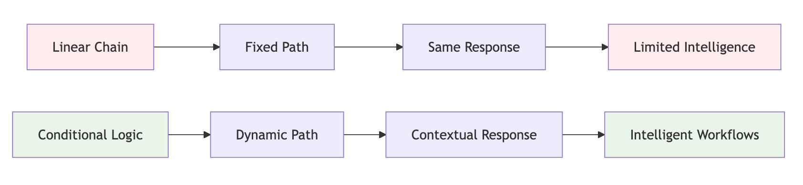
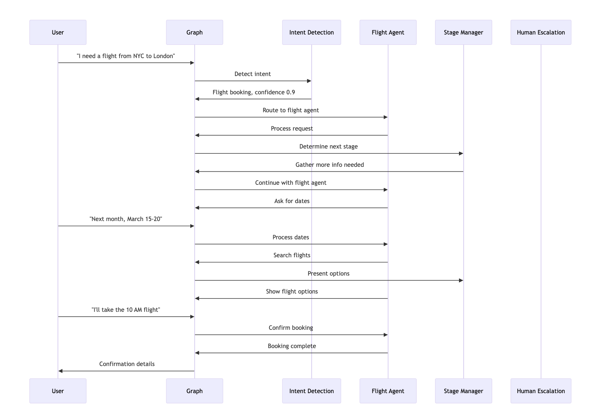

# Conditional Logic and Routing in LangGraph

## Understanding Conditional Logic

Conditional logic is the heart of intelligent workflows in LangGraph. It allows your applications to make dynamic decisions based on the current state, user input, or external conditions.

### Why Conditional Logic Matters



**Traditional Linear Workflows:**
- Fixed execution path
- No context awareness
- Same response for different inputs
- Limited adaptability

**Conditional LangGraph Workflows:**
- Dynamic routing based on content
- Context-aware decisions
- Personalized responses
- Intelligent workflow adaptation

## Theoretical Foundation: Conditional Logic Concepts

### Understanding Decision Trees in LangGraph

Conditional logic in LangGraph is essentially a sophisticated decision tree system. Each node in your graph can make decisions about where to go next based on the current state.

**Key Concepts:**
- **Decision Points**: Nodes that evaluate conditions and choose paths
- **Routing Functions**: Functions that determine the next node
- **Conditional Edges**: Edges that are taken based on conditions
- **State Evaluation**: Using state information to make decisions

### Types of Decision Making

**1. Content-Based Decisions**
- Analyze message content for keywords or patterns
- Route based on detected intent or topic
- Use natural language processing for understanding

**2. State-Based Decisions**
- Consider the current state of the conversation
- Route based on accumulated information
- Make decisions based on conversation history

**3. Confidence-Based Decisions**
- Use confidence scores from intent detection
- Route to different paths based on certainty
- Implement fallback mechanisms for low confidence

**4. Multi-Factor Decisions**
- Combine multiple factors for routing
- Weight different considerations
- Create sophisticated decision matrices

### Conditional Logic Design Patterns

**1. Simple Routing Pattern**
- Single condition evaluation
- Direct mapping of conditions to nodes
- Easy to understand and maintain

**2. Hierarchical Routing Pattern**
- Multiple levels of decision making
- Cascading conditions
- Complex but powerful routing logic

**3. Adaptive Routing Pattern**
- Dynamic routing based on learning
- Adjusts based on conversation context
- Self-improving decision making

## Types of Conditional Logic

### 1. Simple Conditional Edges

The most basic form of conditional logic uses `add_conditional_edges()` to route based on a function's return value.

**Simple Routing Theory:**
- **Single Factor Evaluation**: Consider one primary factor for routing
- **Direct Mapping**: Map conditions directly to destination nodes
- **Clear Logic**: Simple, easy-to-understand routing rules
- **Fast Execution**: Quick decision making for simple cases

**When to Use Simple Routing:**
- Basic intent classification
- Simple content-based routing
- Clear, unambiguous conditions
- Performance-critical applications

```python
from langgraph.graph import StateGraph, END
from typing import TypedDict, Annotated, List
from langchain_core.messages import BaseMessage

class RouterState(TypedDict):
    messages: Annotated[List[BaseMessage], "Conversation messages"]
    intent: Annotated[str, "Detected user intent"]
    confidence: Annotated[float, "Confidence in intent detection"]
    next: Annotated[str, "Next action"]

def route_by_intent(state: RouterState) -> str:
    """Route to different nodes based on detected intent."""
    intent = state["intent"].lower()
    
    if "question" in intent:
        return "answer_question"
    elif "request" in intent:
        return "handle_request"
    elif "complaint" in intent:
        return "handle_complaint"
    else:
        return "general_response"

# Create the graph
workflow = StateGraph(RouterState)

# Add nodes
workflow.add_node("detect_intent", detect_intent_node)
workflow.add_node("answer_question", answer_question_node)
workflow.add_node("handle_request", handle_request_node)
workflow.add_node("handle_complaint", handle_complaint_node)
workflow.add_node("general_response", general_response_node)

# Set entry point
workflow.set_entry_point("detect_intent")

# Add conditional edges
workflow.add_conditional_edges(
    "detect_intent",
    route_by_intent,
    {
        "answer_question": "answer_question",
        "handle_request": "handle_request",
        "handle_complaint": "handle_complaint",
        "general_response": "general_response"
    }
)

# Add edges to end
workflow.add_edge("answer_question", END)
workflow.add_edge("handle_request", END)
workflow.add_edge("handle_complaint", END)
workflow.add_edge("general_response", END)
```

### 2. Complex Conditional Logic

For more sophisticated routing, you can use complex conditional functions that consider multiple factors.

**Complex Routing Theory:**
- **Multi-Factor Analysis**: Consider multiple factors simultaneously
- **Weighted Decisions**: Assign importance to different factors
- **Confidence Thresholds**: Use confidence levels for routing decisions
- **Fallback Mechanisms**: Provide safe fallbacks for edge cases

**Complex Routing Strategies:**
1. **Confidence-Based Routing**: Route based on confidence scores
2. **Context-Aware Routing**: Consider conversation context
3. **Priority-Based Routing**: Handle urgent vs. normal requests
4. **Escalation Routing**: Route complex issues to human agents

```python
def advanced_router(state: RouterState) -> str:
    """Advanced routing based on multiple factors."""
    intent = state["intent"].lower()
    confidence = state["confidence"]
    messages = state["messages"]
    
    # High confidence routing
    if confidence > 0.8:
        if "urgent" in intent or "emergency" in intent:
            return "urgent_escalation"
        elif "technical" in intent:
            return "technical_support"
        elif "billing" in intent:
            return "billing_support"
    
    # Medium confidence routing
    elif confidence > 0.5:
        if len(messages) > 5:  # Long conversation
            return "human_escalation"
        else:
            return "clarification_needed"
    
    # Low confidence routing
    else:
        return "human_escalation"

# Enhanced conditional edges
workflow.add_conditional_edges(
    "detect_intent",
    advanced_router,
    {
        "urgent_escalation": "urgent_escalation",
        "technical_support": "technical_support",
        "billing_support": "billing_support",
        "human_escalation": "human_escalation",
        "clarification_needed": "clarification_needed"
    }
)
```

### 3. State-Based Routing

Route based on the current state rather than just the last message.

**State-Based Routing Theory:**
- **Historical Analysis**: Consider conversation history
- **Pattern Recognition**: Identify patterns in user behavior
- **Context Preservation**: Maintain context across interactions
- **Adaptive Responses**: Adjust based on accumulated information

**State Analysis Techniques:**
1. **Conversation Length**: Route based on conversation duration
2. **Repetition Detection**: Identify repeated requests or issues
3. **Escalation Triggers**: Detect when escalation is needed
4. **Progress Tracking**: Track progress through workflows

```python
def state_based_router(state: RouterState) -> str:
    """Route based on current state and conversation history."""
    messages = state["messages"]
    intent = state["intent"]
    
    # Check conversation length
    if len(messages) > 10:
        return "conversation_summary"
    
    # Check for repeated intents
    recent_intents = [msg.get("intent", "") for msg in messages[-3:]]
    if len(set(recent_intents)) == 1 and len(recent_intents) == 3:
        return "escalate_repetition"
    
    # Check for escalation keywords
    escalation_words = ["manager", "supervisor", "human", "real person"]
    last_message = messages[-1].content.lower()
    if any(word in last_message for word in escalation_words):
        return "human_escalation"
    
    # Default routing
    return "continue_conversation"
```

## Practical Example: Travel Booking System

Let's build a comprehensive travel booking system that demonstrates various conditional logic patterns. Before diving into the code, let's understand the theoretical foundation.

### Understanding Travel Booking Workflows

**Travel Booking Theory:**
1. **Intent Classification**: Identify the type of travel request
2. **Information Gathering**: Collect travel details
3. **Specialized Processing**: Route to domain-specific agents
4. **Booking Management**: Handle the actual booking process
5. **Confirmation and Follow-up**: Complete the booking and provide details

**Multi-Agent Architecture:**
- **Specialized Agents**: Different agents for different travel types
- **Agent Coordination**: How agents work together
- **Escalation Handling**: When to escalate to humans
- **State Management**: Maintaining context across agents

### Step 1: Define the Travel State

**State Design for Travel Systems:**
- **User Preferences**: Store user travel preferences
- **Booking Context**: Track current booking stage
- **Agent Coordination**: Manage which agent is handling the request
- **Information Accumulation**: Build up travel details over time

```python
from typing import TypedDict, Annotated, List, Optional, Dict
from langchain_core.messages import BaseMessage
from datetime import datetime

class TravelState(TypedDict):
    messages: Annotated[List[BaseMessage], "Conversation messages"]
    user_preferences: Annotated[Dict, "User travel preferences"]
    booking_stage: Annotated[str, "Current booking stage"]
    extracted_info: Annotated[Dict, "Extracted booking information"]
    agent_type: Annotated[str, "Type of agent handling the request"]
    next: Annotated[str, "Next action"]
```

### Step 2: Create Specialized Agents

**Agent Specialization Theory:**
- **Domain Expertise**: Each agent specializes in a specific domain
- **Knowledge Boundaries**: Clear boundaries between agent responsibilities
- **Inter-Agent Communication**: How agents share information
- **Agent Selection**: Criteria for choosing the right agent

**Agent Design Principles:**
1. **Single Responsibility**: Each agent handles one type of request
2. **Expert Knowledge**: Deep knowledge in their domain
3. **Consistent Interface**: Standard interface for all agents
4. **State Awareness**: Agents understand and modify state appropriately

```python
from langchain_anthropic import ChatAnthropic
from langchain_core.messages import HumanMessage, AIMessage

class FlightAgent:
    def __init__(self):
        self.llm = ChatAnthropic(model="claude-3-sonnet-20240229")
    
    def process(self, state: TravelState) -> TravelState:
        """Process flight booking requests."""
        messages = state["messages"]
        preferences = state["user_preferences"]
        
        system_prompt = """
        You are a flight booking specialist. Help users book flights by:
        1. Extracting travel details (origin, destination, dates, passengers)
        2. Suggesting optimal flight options
        3. Handling booking confirmations
        4. Providing travel tips
        
        Be helpful, efficient, and knowledgeable about airlines and routes.
        """
        
        response = self.llm.invoke([{"role": "system", "content": system_prompt}] + messages)
        
        return {
            **state,
            "messages": messages + [response],
            "agent_type": "flight_specialist"
        }

class HotelAgent:
    def __init__(self):
        self.llm = ChatAnthropic(model="claude-3-sonnet-20240229")
    
    def process(self, state: TravelState) -> TravelState:
        """Process hotel booking requests."""
        messages = state["messages"]
        preferences = state["user_preferences"]
        
        system_prompt = """
        You are a hotel booking specialist. Help users find and book hotels by:
        1. Understanding accommodation preferences (budget, location, amenities)
        2. Suggesting suitable hotels
        3. Handling booking confirmations
        4. Providing local area information
        
        Be knowledgeable about different hotel types and locations.
        """
        
        response = self.llm.invoke([{"role": "system", "content": system_prompt}] + messages)
        
        return {
            **state,
            "messages": messages + [response],
            "agent_type": "hotel_specialist"
        }

class CarRentalAgent:
    def __init__(self):
        self.llm = ChatAnthropic(model="claude-3-sonnet-20240229")
    
    def process(self, state: TravelState) -> TravelState:
        """Process car rental requests."""
        messages = state["messages"]
        preferences = state["user_preferences"]
        
        system_prompt = """
        You are a car rental specialist. Help users rent vehicles by:
        1. Understanding vehicle needs (size, type, duration)
        2. Suggesting suitable rental options
        3. Explaining insurance and rental policies
        4. Handling booking confirmations
        
        Be knowledgeable about different vehicle types and rental requirements.
        """
        
        response = self.llm.invoke([{"role": "system", "content": system_prompt}] + messages)
        
        return {
            **state,
            "messages": messages + [response],
            "agent_type": "car_rental_specialist"
        }

class GeneralTravelAgent:
    def __init__(self):
        self.llm = ChatAnthropic(model="claude-3-sonnet-20240229")
    
    def process(self, state: TravelState) -> TravelState:
        """Handle general travel inquiries."""
        messages = state["messages"]
        
        system_prompt = """
        You are a general travel assistant. Help users with:
        1. General travel planning questions
        2. Destination recommendations
        3. Travel tips and advice
        4. Routing to specialized agents when needed
        
        Be friendly and helpful, and suggest specialized agents when appropriate.
        """
        
        response = self.llm.invoke([{"role": "system", "content": system_prompt}] + messages)
        
        return {
            **state,
            "messages": messages + [response],
            "agent_type": "general_assistant"
        }
```

### Step 3: Create Routing Logic

**Routing Logic Theory:**
- **Intent Detection**: Identify what the user wants
- **Confidence Scoring**: Assess how certain we are about the intent
- **Agent Selection**: Choose the most appropriate agent
- **Escalation Logic**: Determine when to escalate to humans

**Routing Decision Factors:**
1. **Content Analysis**: Keywords and patterns in user messages
2. **Context Consideration**: Current conversation context
3. **User History**: Previous interactions and preferences
4. **System Capabilities**: Available agents and their expertise

```python
def detect_travel_intent(state: TravelState) -> TravelState:
    """Detect the type of travel request and route accordingly."""
    messages = state["messages"]
    last_message = messages[-1].content.lower()
    
    # Define intent patterns
    flight_patterns = ["flight", "fly", "airline", "airport", "plane", "booking flight"]
    hotel_patterns = ["hotel", "accommodation", "room", "stay", "lodging", "reservation"]
    car_patterns = ["car", "vehicle", "rental", "drive", "transportation"]
    
    # Detect intent
    if any(pattern in last_message for pattern in flight_patterns):
        intent = "flight_booking"
        confidence = 0.9
    elif any(pattern in last_message for pattern in hotel_patterns):
        intent = "hotel_booking"
        confidence = 0.9
    elif any(pattern in last_message for pattern in car_patterns):
        intent = "car_rental"
        confidence = 0.9
    else:
        intent = "general_travel"
        confidence = 0.6
    
    return {
        **state,
        "intent": intent,
        "confidence": confidence,
        "next": intent
    }

def route_to_agent(state: TravelState) -> str:
    """Route to the appropriate specialized agent."""
    intent = state.get("intent", "general_travel")
    
    routing_map = {
        "flight_booking": "flight_agent",
        "hotel_booking": "hotel_agent",
        "car_rental": "car_rental_agent",
        "general_travel": "general_agent"
    }
    
    return routing_map.get(intent, "general_agent")

def check_escalation_needed(state: TravelState) -> str:
    """Check if the request needs human escalation."""
    messages = state["messages"]
    confidence = state.get("confidence", 0.5)
    
    # Escalation triggers
    escalation_triggers = [
        "manager", "supervisor", "human", "real person", "speak to someone",
        "complicated", "urgent", "emergency", "complaint"
    ]
    
    last_message = messages[-1].content.lower()
    
    # Check for escalation keywords
    if any(trigger in last_message for trigger in escalation_triggers):
        return "human_escalation"
    
    # Check confidence level
    if confidence < 0.3:
        return "human_escalation"
    
    # Check conversation length
    if len(messages) > 15:
        return "human_escalation"
    
    return "continue_with_agent"

def determine_next_stage(state: TravelState) -> str:
    """Determine the next stage in the booking process."""
    booking_stage = state.get("booking_stage", "initial")
    extracted_info = state.get("extracted_info", {})
    
    # Stage progression logic
    if booking_stage == "initial":
        if "origin" in extracted_info and "destination" in extracted_info:
            return "search_options"
        else:
            return "gather_info"
    
    elif booking_stage == "search_options":
        if "selected_option" in extracted_info:
            return "confirm_booking"
        else:
            return "present_options"
    
    elif booking_stage == "confirm_booking":
        if "confirmed" in extracted_info:
            return "booking_complete"
        else:
            return "handle_confirmation"
    
    return "continue_conversation"
```

### Step 4: Create the Travel Graph

**Graph Design Theory:**
- **Node Organization**: How to organize different types of nodes
- **Edge Management**: Managing different types of edges
- **Conditional Logic**: Implementing complex routing logic
- **Error Handling**: Handling edge cases and errors

**Graph Architecture Principles:**
1. **Modularity**: Separate concerns into different nodes
2. **Scalability**: Design for easy addition of new agents
3. **Maintainability**: Clear structure that's easy to understand
4. **Reliability**: Robust error handling and fallbacks

```python
def create_travel_graph():
    """Create the travel booking workflow graph."""
    workflow = StateGraph(TravelState)
    
    # Initialize agents
    flight_agent = FlightAgent()
    hotel_agent = HotelAgent()
    car_rental_agent = CarRentalAgent()
    general_agent = GeneralTravelAgent()
    
    # Add nodes
    workflow.add_node("detect_intent", detect_travel_intent)
    workflow.add_node("flight_agent", flight_agent.process)
    workflow.add_node("hotel_agent", hotel_agent.process)
    workflow.add_node("car_rental_agent", car_rental_agent.process)
    workflow.add_node("general_agent", general_agent.process)
    workflow.add_node("human_escalation", handle_human_escalation)
    workflow.add_node("determine_stage", determine_next_stage)
    
    # Set entry point
    workflow.set_entry_point("detect_intent")
    
    # Add conditional edges for agent routing
    workflow.add_conditional_edges(
        "detect_intent",
        route_to_agent,
        {
            "flight_agent": "flight_agent",
            "hotel_agent": "hotel_agent",
            "car_rental_agent": "car_rental_agent",
            "general_agent": "general_agent"
        }
    )
    
    # Add conditional edges for escalation
    workflow.add_conditional_edges(
        "flight_agent",
        check_escalation_needed,
        {
            "human_escalation": "human_escalation",
            "continue_with_agent": "determine_stage"
        }
    )
    
    workflow.add_conditional_edges(
        "hotel_agent",
        check_escalation_needed,
        {
            "human_escalation": "human_escalation",
            "continue_with_agent": "determine_stage"
        }
    )
    
    workflow.add_conditional_edges(
        "car_rental_agent",
        check_escalation_needed,
        {
            "human_escalation": "human_escalation",
            "continue_with_agent": "determine_stage"
        }
    )
    
    workflow.add_conditional_edges(
        "general_agent",
        check_escalation_needed,
        {
            "human_escalation": "human_escalation",
            "continue_with_agent": "determine_stage"
        }
    )
    
    # Add stage progression edges
    workflow.add_conditional_edges(
        "determine_stage",
        lambda state: state.get("next", "continue_conversation"),
        {
            "gather_info": "general_agent",
            "search_options": "general_agent",
            "present_options": "general_agent",
            "confirm_booking": "general_agent",
            "handle_confirmation": "general_agent",
            "booking_complete": END,
            "continue_conversation": "general_agent"
        }
    )
    
    workflow.add_edge("human_escalation", END)
    
    return workflow.compile()

# Usage
app = create_travel_graph()

# Initialize state
initial_state = {
    "messages": [HumanMessage(content="I need to book a flight from New York to London next month")],
    "user_preferences": {},
    "booking_stage": "initial",
    "extracted_info": {},
    "agent_type": "",
    "next": ""
}

# Run the graph
result = app.invoke(initial_state)
```

## Interactive Exercises

### Exercise 1: Intent Classification

**Challenge**: Create a more sophisticated intent classification system that can handle complex, multi-intent requests.

<details>
<summary>Starter Code</summary>

```python
def advanced_intent_classifier(state: TravelState) -> TravelState:
    """Advanced intent classification with confidence scoring."""
    messages = state["messages"]
    last_message = messages[-1].content.lower()
    
    # Define intent patterns with weights
    intent_patterns = {
        "flight_booking": {
            "patterns": ["flight", "fly", "airline", "airport", "plane"],
            "weight": 1.0
        },
        "hotel_booking": {
            "patterns": ["hotel", "accommodation", "room", "stay", "lodging"],
            "weight": 1.0
        },
        "car_rental": {
            "patterns": ["car", "vehicle", "rental", "drive", "transportation"],
            "weight": 1.0
        },
        "travel_planning": {
            "patterns": ["plan", "itinerary", "schedule", "trip", "vacation"],
            "weight": 0.8
        },
        "travel_advice": {
            "patterns": ["advice", "recommend", "suggest", "tips", "best"],
            "weight": 0.7
        }
    }
    
    # Calculate intent scores
    intent_scores = {}
    for intent, config in intent_patterns.items():
        score = 0
        for pattern in config["patterns"]:
            if pattern in last_message:
                score += config["weight"]
        if score > 0:
            intent_scores[intent] = score
    
    # Determine primary intent
    if intent_scores:
        primary_intent = max(intent_scores, key=intent_scores.get)
        confidence = min(intent_scores[primary_intent] / 2.0, 1.0)
    else:
        primary_intent = "general_travel"
        confidence = 0.3
    
    return {
        **state,
        "intent": primary_intent,
        "confidence": confidence,
        "intent_scores": intent_scores
    }
```
</details>

### Exercise 2: Dynamic Routing

**Challenge**: Create a routing system that can dynamically add new agents based on user needs.

<details>
<summary>Solution</summary>

```python
class DynamicRouter:
    def __init__(self):
        self.available_agents = {
            "flight_agent": FlightAgent(),
            "hotel_agent": HotelAgent(),
            "car_rental_agent": CarRentalAgent(),
            "general_agent": GeneralTravelAgent()
        }
        self.agent_requirements = {
            "flight_agent": ["origin", "destination", "date"],
            "hotel_agent": ["location", "check_in", "check_out"],
            "car_rental_agent": ["location", "pickup_date", "return_date"]
        }
    
    def can_handle_request(self, agent_name: str, extracted_info: dict) -> bool:
        """Check if an agent can handle the request with available information."""
        if agent_name not in self.agent_requirements:
            return True  # General agent can handle anything
        
        required_fields = self.agent_requirements[agent_name]
        available_fields = list(extracted_info.keys())
        
        # Check if we have enough information
        missing_fields = [field for field in required_fields if field not in available_fields]
        return len(missing_fields) <= 1  # Allow one missing field
    
    def select_best_agent(self, state: TravelState) -> str:
        """Select the best agent based on intent and available information."""
        intent = state.get("intent", "general_travel")
        extracted_info = state.get("extracted_info", {})
        
        # Map intent to agent
        intent_to_agent = {
            "flight_booking": "flight_agent",
            "hotel_booking": "hotel_agent",
            "car_rental": "car_rental_agent"
        }
        
        preferred_agent = intent_to_agent.get(intent, "general_agent")
        
        # Check if preferred agent can handle the request
        if self.can_handle_request(preferred_agent, extracted_info):
            return preferred_agent
        
        # Fall back to general agent
        return "general_agent"

def dynamic_route_to_agent(state: TravelState) -> str:
    """Dynamically route to the best available agent."""
    router = DynamicRouter()
    return router.select_best_agent(state)
```
</details>

### Exercise 3: Conversation Flow Management

**Challenge**: Create a system that manages conversation flow and prevents infinite loops.

<details>
<summary>Advanced Solution</summary>

```python
class ConversationManager:
    def __init__(self):
        self.max_conversation_length = 20
        self.escalation_thresholds = {
            "repetition_count": 3,
            "low_confidence_count": 5,
            "clarification_requests": 3
        }
    
    def analyze_conversation_health(self, state: TravelState) -> dict:
        """Analyze the health of the conversation."""
        messages = state["messages"]
        conversation_metrics = {
            "length": len(messages),
            "repetition_count": 0,
            "low_confidence_count": 0,
            "clarification_requests": 0,
            "escalation_needed": False
        }
        
        # Check for repetition
        recent_messages = [msg.content.lower() for msg in messages[-5:]]
        unique_messages = set(recent_messages)
        if len(recent_messages) > 3 and len(unique_messages) <= 2:
            conversation_metrics["repetition_count"] += 1
        
        # Check for low confidence responses
        if state.get("confidence", 1.0) < 0.5:
            conversation_metrics["low_confidence_count"] += 1
        
        # Check for clarification requests
        clarification_phrases = ["can you clarify", "what do you mean", "I don't understand"]
        for msg in messages[-3:]:
            if any(phrase in msg.content.lower() for phrase in clarification_phrases):
                conversation_metrics["clarification_requests"] += 1
        
        # Determine if escalation is needed
        for metric, threshold in self.escalation_thresholds.items():
            if conversation_metrics[metric] >= threshold:
                conversation_metrics["escalation_needed"] = True
                break
        
        if conversation_metrics["length"] >= self.max_conversation_length:
            conversation_metrics["escalation_needed"] = True
        
        return conversation_metrics

def manage_conversation_flow(state: TravelState) -> str:
    """Manage conversation flow and prevent issues."""
    manager = ConversationManager()
    health_metrics = manager.analyze_conversation_health(state)
    
    if health_metrics["escalation_needed"]:
        return "human_escalation"
    
    # Continue with normal flow
    return "continue_conversation"
```
</details>

## Step-by-Step Walkthrough

Let's trace through a complex travel booking interaction:



**Detailed Flow:**
1. **User Input**: "I need a flight from NYC to London"
2. **Intent Detection**: Identifies flight booking with high confidence
3. **Agent Routing**: Routes to specialized flight agent
4. **Information Gathering**: Extracts origin/destination, requests dates
5. **Stage Progression**: Moves through booking stages
6. **Confirmation**: Completes booking and provides details

## Key Takeaways

### What You've Learned
- **Conditional Routing**: How to create dynamic, intelligent workflows
- **Intent Classification**: Advanced pattern matching and confidence scoring
- **Multi-Agent Systems**: Specialized agents for different tasks
- **Flow Management**: Preventing loops and managing conversation health

### Next Steps
- **Multi-Agent Systems**: Create more sophisticated agent coordination
- **Advanced Patterns**: Implement interrupts and human-in-the-loop
- **Real-World Applications**: Build production-ready systems

### Best Practices
- **Clear Routing Logic**: Make conditional functions easy to understand and maintain
- **Fallback Handling**: Always provide fallback paths for edge cases
- **Conversation Health**: Monitor and manage conversation quality
- **Agent Specialization**: Create focused, expert agents for specific domains

## Troubleshooting

### Common Issues

**Issue**: "Infinite routing loops"
- **Solution**: Add conversation length limits and escalation triggers

**Issue**: "Low confidence routing"
- **Solution**: Implement confidence thresholds and fallback mechanisms

**Issue**: "Agent confusion"
- **Solution**: Create clear agent boundaries and routing rules

### Debugging Tips

```python
# Add routing debugging
def debug_routing(state: TravelState, route_function):
    """Debug routing decisions."""
    print(f"Current state: {state}")
    print(f"Routing function: {route_function.__name__}")
    result = route_function(state)
    print(f"Routing result: {result}")
    print("-" * 50)
    return result

# Enhanced routing with debugging
def safe_route_to_agent(state: TravelState) -> str:
    """Safe routing with debugging and fallbacks."""
    try:
        result = debug_routing(state, route_to_agent)
        return result
    except Exception as e:
        print(f"Routing error: {e}")
        return "general_agent"  # Safe fallback
```

## Try It Yourself!

**Interactive Challenge**: Build a restaurant recommendation system with conditional logic that:
1. Analyzes user preferences and dietary restrictions
2. Routes to specialized agents (Italian, Asian, American, etc.)
3. Handles booking requests and dietary accommodations
4. Escalates to human staff for complex requests

<details>
<summary>Starter Template</summary>

```python
class RestaurantState(TypedDict):
    messages: Annotated[List[BaseMessage], "Conversation messages"]
    user_preferences: Annotated[Dict, "User dining preferences"]
    dietary_restrictions: Annotated[List[str], "Dietary restrictions"]
    cuisine_preference: Annotated[str, "Preferred cuisine type"]
    booking_stage: Annotated[str, "Current booking stage"]
    next: Annotated[str, "Next action"]

def route_restaurant_request(state: RestaurantState) -> str:
    """Route restaurant requests to specialized agents."""
    cuisine = state.get("cuisine_preference", "").lower()
    
    cuisine_agents = {
        "italian": "italian_agent",
        "chinese": "chinese_agent",
        "japanese": "japanese_agent",
        "mexican": "mexican_agent",
        "american": "american_agent"
    }
    
    return cuisine_agents.get(cuisine, "general_restaurant_agent")
```
</details>

---

**Ready for the next level?** Continue to [Multi-Agent Systems](./04-multi-agent-systems.md) to learn how to coordinate multiple specialized agents! 