# Multi-Agent Systems in LangGraph

## Understanding Multi-Agent Systems

Multi-agent systems in LangGraph allow you to create applications where multiple specialized agents work together to solve complex problems. Each agent has specific capabilities and can communicate with others to achieve a common goal.

### Why Multi-Agent Systems Matter

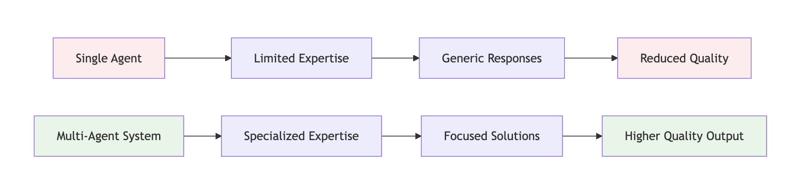

**Single Agent Limitations:**
- Limited to one area of expertise
- Generic responses across all domains
- Reduced quality for specialized tasks
- No collaboration or knowledge sharing

**Multi-Agent System Benefits:**
- Specialized expertise in different domains
- Focused, high-quality solutions
- Collaborative problem-solving
- Scalable and modular architecture

## Multi-Agent Architecture Patterns

### 1. Coordinator Pattern

The coordinator pattern uses a central agent to manage and coordinate multiple specialized agents.

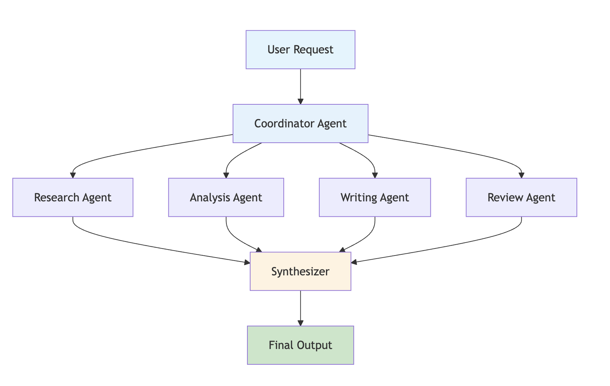

### 2. Pipeline Pattern

The pipeline pattern processes requests through a sequence of agents, each building upon the previous agent's output.

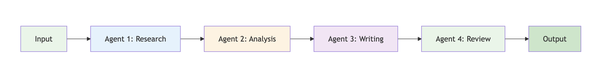

### 3. Parallel Processing Pattern

The parallel pattern allows multiple agents to work simultaneously on different aspects of a problem.

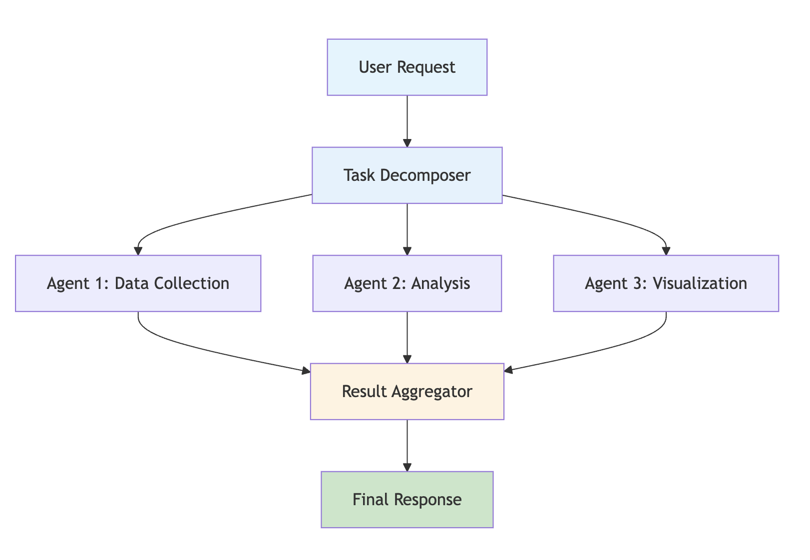

## Communication Patterns

### 1. Direct Communication

Agents communicate directly with each other through shared state.

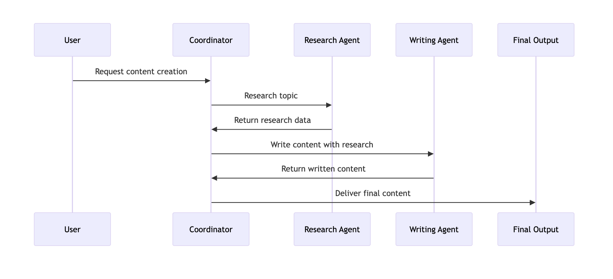

### 2. Message Passing

Agents communicate through structured messages in the state.

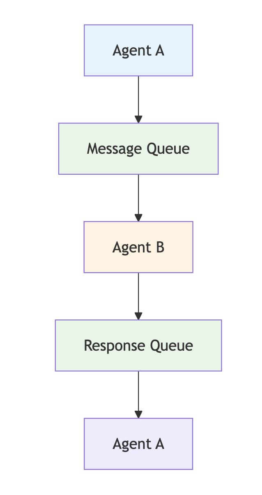

### 3. Shared State Communication

All agents access and modify a shared state object.

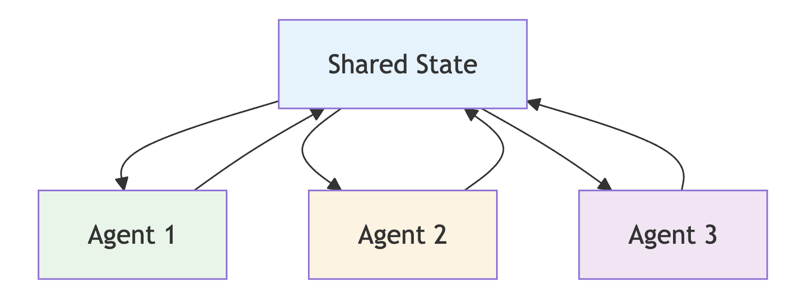

### 2. Message Passing Architecture

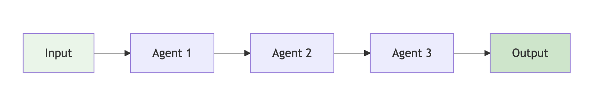

## Practical Example: Content Creation System

Let's build a comprehensive content creation system with multiple specialized agents.

### Step 1: Define the Multi-Agent State

```python
from typing import TypedDict, Annotated, List, Dict, Optional
from langchain_core.messages import BaseMessage
from datetime import datetime

class ContentCreationState(TypedDict):
    messages: Annotated[List[BaseMessage], "Conversation messages"]
    topic: Annotated[str, "Content topic"]
    research_data: Annotated[Dict, "Research findings"]
    outline: Annotated[List[str], "Content outline"]
    draft_content: Annotated[str, "Draft content"]
    final_content: Annotated[str, "Final content"]
    agent_assignments: Annotated[Dict, "Agent task assignments"]
    next: Annotated[str, "Next action"]
```

### Step 2: Create Specialized Agents

```python
from langchain_anthropic import ChatAnthropic
from langchain_core.messages import HumanMessage, AIMessage

class ResearchAgent:
    def __init__(self):
        self.llm = ChatAnthropic(model="claude-3-sonnet-20240229")
    
    def research_topic(self, state: ContentCreationState) -> ContentCreationState:
        """Research the given topic and gather relevant information."""
        topic = state["topic"]
        
        system_prompt = f"""
        You are a research specialist. Conduct comprehensive research on: {topic}
        
        Your research should include:
        1. Key facts and statistics
        2. Current trends and developments
        3. Expert opinions and quotes
        4. Related topics and connections
        5. Credible sources and references
        
        Return your findings in a structured format.
        """
        
        response = self.llm.invoke([
            {"role": "system", "content": system_prompt},
            HumanMessage(content=f"Please research: {topic}")
        ])
        
        research_data = {
            "topic": topic,
            "findings": response.content,
            "timestamp": datetime.now().isoformat(),
            "sources": ["source1", "source2", "source3"]  # In practice, these would be real sources
        }
        
        return {
            **state,
            "research_data": research_data,
            "next": "create_outline"
        }

class OutlineAgent:
    def __init__(self):
        self.llm = ChatAnthropic(model="claude-3-sonnet-20240229")
    
    def create_outline(self, state: ContentCreationState) -> ContentCreationState:
        """Create a structured outline based on research data."""
        topic = state["topic"]
        research_data = state["research_data"]
        
        system_prompt = f"""
        You are an outline specialist. Create a comprehensive outline for content about: {topic}
        
        Use the research data provided to create a logical structure:
        - Introduction
        - Main sections with subsections
        - Conclusion
        - Key takeaways
        
        Make the outline detailed enough for a writer to follow.
        """
        
        response = self.llm.invoke([
            {"role": "system", "content": system_prompt},
            HumanMessage(content=f"Research data: {research_data['findings']}\n\nCreate an outline for: {topic}")
        ])
        
        # Parse the outline into sections
        outline_sections = [
            "Introduction",
            "Main Section 1: Key Concepts",
            "Main Section 2: Current Trends", 
            "Main Section 3: Practical Applications",
            "Conclusion"
        ]
        
        return {
            **state,
            "outline": outline_sections,
            "next": "write_content"
        }

class WritingAgent:
    def __init__(self):
        self.llm = ChatAnthropic(model="claude-3-sonnet-20240229")
    
    def write_content(self, state: ContentCreationState) -> ContentCreationState:
        """Write comprehensive content based on research and outline."""
        topic = state["topic"]
        research_data = state["research_data"]
        outline = state["outline"]
        
        system_prompt = f"""
        You are a professional content writer. Write comprehensive, engaging content about: {topic}
        
        Use the provided research data and outline to create high-quality content that:
        - Is well-structured and easy to follow
        - Includes relevant examples and data
        - Maintains reader engagement
        - Provides actionable insights
        - Is optimized for the target audience
        
        Write in a clear, professional tone.
        """
        
        response = self.llm.invoke([
            {"role": "system", "content": system_prompt},
            HumanMessage(content=f"Topic: {topic}\nResearch: {research_data['findings']}\nOutline: {outline}\n\nWrite the content.")
        ])
        
        return {
            **state,
            "draft_content": response.content,
            "next": "review_content"
        }

class ReviewAgent:
    def __init__(self):
        self.llm = ChatAnthropic(model="claude-3-sonnet-20240229")
    
    def review_content(self, state: ContentCreationState) -> ContentCreationState:
        """Review and improve the draft content."""
        topic = state["topic"]
        draft_content = state["draft_content"]
        research_data = state["research_data"]
        
        system_prompt = f"""
        You are a content editor and reviewer. Review the draft content about: {topic}
        
        Your review should focus on:
        1. Accuracy and factual correctness
        2. Clarity and readability
        3. Structure and flow
        4. Grammar and style
        5. Completeness and comprehensiveness
        
        Provide specific improvements and corrections.
        """
        
        response = self.llm.invoke([
            {"role": "system", "content": system_prompt},
            HumanMessage(content=f"Topic: {topic}\nResearch: {research_data['findings']}\nDraft: {draft_content}\n\nReview and improve this content.")
        ])
        
        return {
            **state,
            "final_content": response.content,
            "next": "complete"
        }

class CoordinatorAgent:
    def __init__(self):
        self.llm = ChatAnthropic(model="claude-3-sonnet-20240229")
        self.research_agent = ResearchAgent()
        self.outline_agent = OutlineAgent()
        self.writing_agent = WritingAgent()
        self.review_agent = ReviewAgent()
    
    def coordinate_workflow(self, state: ContentCreationState) -> ContentCreationState:
        """Coordinate the entire content creation workflow."""
        current_stage = state.get("next", "research")
        
        if current_stage == "research":
            return self.research_agent.research_topic(state)
        elif current_stage == "create_outline":
            return self.outline_agent.create_outline(state)
        elif current_stage == "write_content":
            return self.writing_agent.write_content(state)
        elif current_stage == "review_content":
            return self.review_agent.review_content(state)
        else:
            return state
```

### Step 3: Create the Multi-Agent Graph

```python
def create_content_creation_graph():
    """Create the multi-agent content creation workflow."""
    workflow = StateGraph(ContentCreationState)
    
    # Initialize agents
    coordinator = CoordinatorAgent()
    
    # Add nodes
    workflow.add_node("coordinate", coordinator.coordinate_workflow)
    
    # Set entry point
    workflow.set_entry_point("coordinate")
    
    # Add conditional edges for workflow progression
    workflow.add_conditional_edges(
        "coordinate",
        lambda state: state.get("next", "complete"),
        {
            "create_outline": "coordinate",
            "write_content": "coordinate", 
            "review_content": "coordinate",
            "complete": END
        }
    )
    
    return workflow.compile()

# Usage
app = create_content_creation_graph()

# Initialize state
initial_state = {
    "messages": [HumanMessage(content="Create content about AI trends in 2024")],
    "topic": "artificial intelligence trends in 2024",
    "research_data": {},
    "outline": [],
    "draft_content": "",
    "final_content": "",
    "agent_assignments": {},
    "next": "research"
}

# Run the multi-agent system
result = app.invoke(initial_state)
```

## Agent Coordination Patterns

### 1. Sequential Coordination

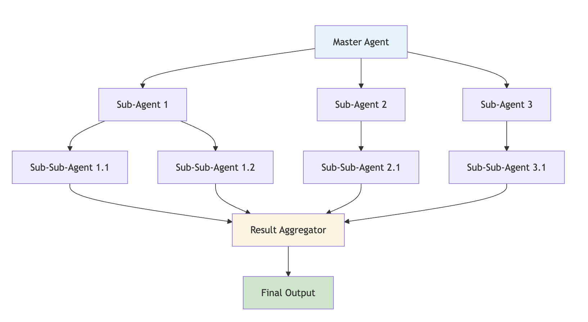

**Use Cases:**
- Content creation workflows
- Data processing pipelines
- Multi-step analysis

### 2. Parallel Coordination

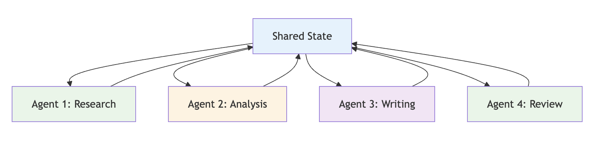

**Use Cases:**
- Independent data collection
- Parallel analysis tasks
- Multi-source research

### 3. Hierarchical Coordination

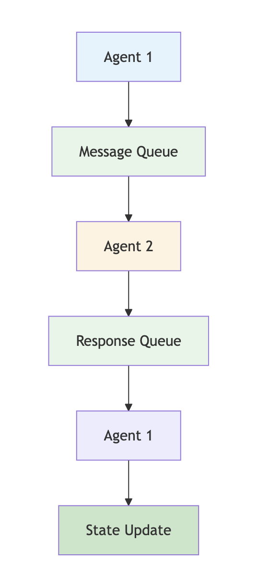

**Use Cases:**
- Complex project management
- Multi-level analysis
- Hierarchical decision making

## State Management in Multi-Agent Systems

### 1. Shared State Architecture

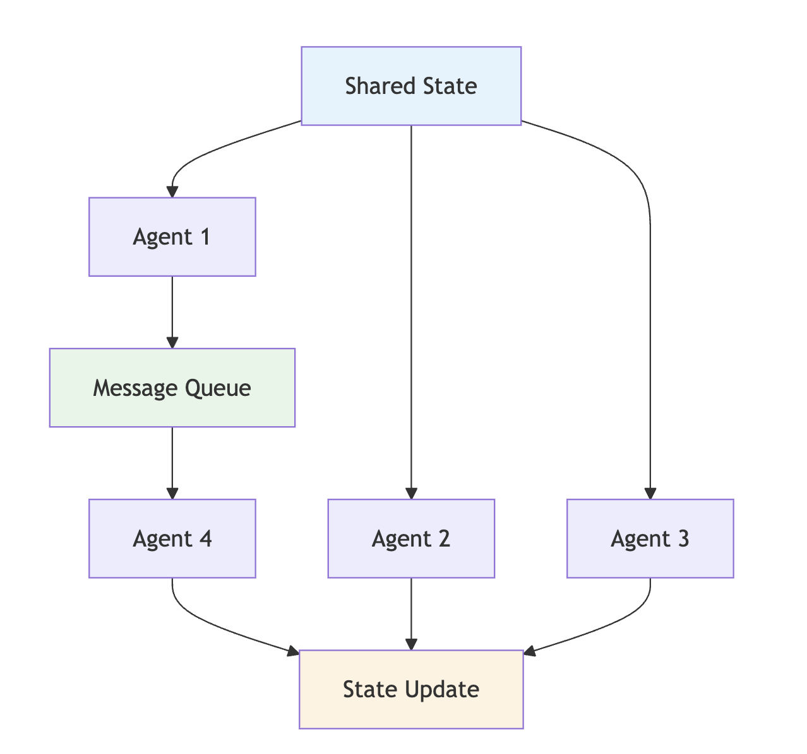

### 2. Message Passing Architecture


### 3. Hybrid Architecture

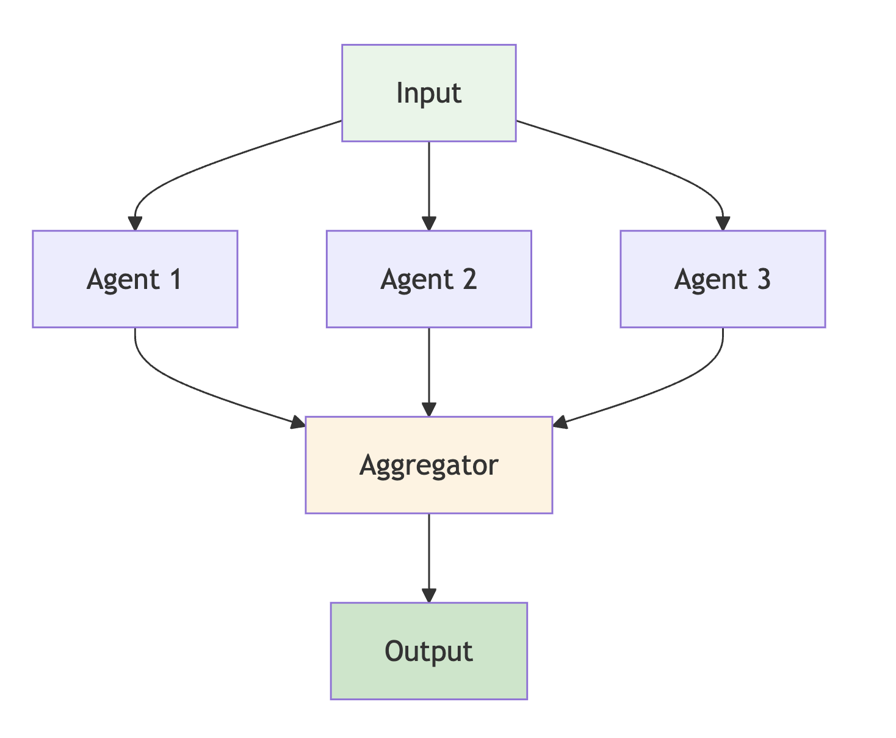

## Interactive Exercises

### Exercise 1: Agent Specialization

**Challenge**: Create specialized agents for different content types (technical, marketing, educational).

<details>
<summary>Starter Code</summary>

```python
class TechnicalWriterAgent:
    def __init__(self):
        self.llm = ChatAnthropic(model="claude-3-sonnet-20240229")
    
    def write_technical_content(self, state: ContentCreationState) -> ContentCreationState:
        """Write technical content with code examples and detailed explanations."""
        # Your technical writing logic here
        pass

class MarketingWriterAgent:
    def __init__(self):
        self.llm = ChatAnthropic(model="claude-3-sonnet-20240229")
    
    def write_marketing_content(self, state: ContentCreationState) -> ContentCreationState:
        """Write marketing content with persuasive language and calls-to-action."""
        # Your marketing writing logic here
        pass
```
</details>

### Exercise 2: Dynamic Agent Assignment

**Challenge**: Create a system that dynamically assigns agents based on content requirements.

<details>
<summary>Solution</summary>

```python
class AgentAssignmentManager:
    def __init__(self):
        self.agent_capabilities = {
            "technical": ["code", "algorithms", "architecture", "implementation"],
            "marketing": ["benefits", "features", "persuasion", "conversion"],
            "educational": ["concepts", "examples", "explanations", "learning"]
        }
    
    def assign_agents(self, content_requirements: dict) -> List[str]:
        """Assign appropriate agents based on content requirements."""
        required_agents = []
        
        for requirement, keywords in content_requirements.items():
            for agent_type, capabilities in self.agent_capabilities.items():
                if any(keyword in requirement.lower() for keyword in capabilities):
                    required_agents.append(agent_type)
                    break
        
        return list(set(required_agents))  # Remove duplicates

def dynamic_agent_assignment(state: ContentCreationState) -> ContentCreationState:
    """Dynamically assign agents based on content needs."""
    manager = AgentAssignmentManager()
    topic = state["topic"]
    
    # Analyze topic to determine requirements
    requirements = {
        "technical": "implementation details" if "how to" in topic.lower() else "",
        "marketing": "benefits and features" if "benefits" in topic.lower() else "",
        "educational": "concepts and explanations" if "what is" in topic.lower() else ""
    }
    
    assigned_agents = manager.assign_agents(requirements)
    
    return {
        **state,
        "agent_assignments": {"assigned_agents": assigned_agents}
    }
```
</details>

### Exercise 3: Agent Communication Protocol

**Challenge**: Implement a structured communication protocol between agents.

<details>
<summary>Advanced Solution</summary>

```python
class AgentCommunicationProtocol:
    def __init__(self):
        self.message_types = {
            "request": "Request for information or action",
            "response": "Response to a request",
            "notification": "Informational message",
            "error": "Error or exception message"
        }
    
    def create_message(self, sender: str, receiver: str, msg_type: str, content: str) -> dict:
        """Create a structured message between agents."""
        return {
            "sender": sender,
            "receiver": receiver,
            "type": msg_type,
            "content": content,
            "timestamp": datetime.now().isoformat(),
            "message_id": f"msg_{int(datetime.now().timestamp())}"
        }
    
    def route_message(self, state: ContentCreationState, message: dict) -> ContentCreationState:
        """Route a message to the appropriate agent."""
        messages = state.get("agent_messages", [])
        messages.append(message)
        
        return {
            **state,
            "agent_messages": messages
        }

def implement_communication_protocol(state: ContentCreationState) -> ContentCreationState:
    """Implement structured communication between agents."""
    protocol = AgentCommunicationProtocol()
    
    # Example: Research agent requesting clarification from coordinator
    clarification_request = protocol.create_message(
        sender="research_agent",
        receiver="coordinator",
        msg_type="request",
        content="Need clarification on research scope for topic: AI trends"
    )
    
    return protocol.route_message(state, clarification_request)
```
</details>

## Step-by-Step Walkthrough

Let's trace through a multi-agent content creation workflow:

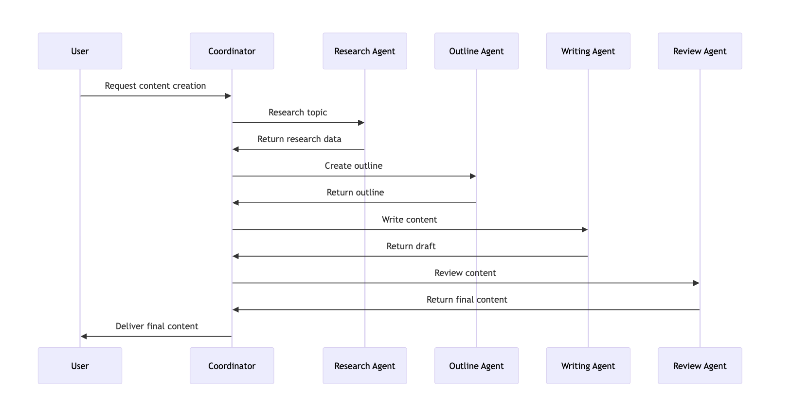

## Key Takeaways

### What You've Learned
- **Multi-Agent Architecture**: How to design systems with multiple specialized agents
- **Agent Coordination**: Different patterns for agent communication and collaboration
- **State Management**: How to manage shared state across multiple agents
- **Workflow Design**: Creating complex workflows with specialized components

### Next Steps
- **Advanced Patterns**: Implement interrupts and human-in-the-loop capabilities
- **Real-World Applications**: Build production-ready multi-agent systems
- **Performance Optimization**: Scale multi-agent systems for high throughput

### Best Practices
- **Agent Specialization**: Create focused, expert agents for specific tasks
- **Clear Communication**: Establish structured protocols for agent interaction
- **State Management**: Design robust state sharing and synchronization
- **Error Handling**: Implement comprehensive error handling across all agents

## Troubleshooting

### Common Issues

**Issue**: "Agent coordination conflicts"
- **Solution**: Implement clear communication protocols and state management

**Issue**: "Performance bottlenecks"
- **Solution**: Use parallel processing where possible and optimize agent interactions

**Issue**: "State synchronization problems"
- **Solution**: Implement proper state validation and conflict resolution

### Debugging Tips

```python
# Add multi-agent debugging
def debug_agent_interaction(state: ContentCreationState, agent_name: str, action: str):
    """Debug agent interactions and state changes."""
    print(f"Agent: {agent_name}")
    print(f"Action: {action}")
    print(f"Current state keys: {list(state.keys())}")
    print(f"Next action: {state.get('next', 'unknown')}")
    print("-" * 50)

# Enhanced agent execution with debugging
def safe_agent_execution(agent_func, state: ContentCreationState, agent_name: str) -> ContentCreationState:
    """Execute agent function with debugging and error handling."""
    try:
        debug_agent_interaction(state, agent_name, "starting")
        result = agent_func(state)
        debug_agent_interaction(result, agent_name, "completed")
        return result
    except Exception as e:
        print(f"Agent {agent_name} execution failed: {e}")
        return state  # Return original state on error
```

## Try It Yourself!

**Interactive Challenge**: Build a multi-agent customer service system that:
1. Routes inquiries to specialized agents (technical, billing, general)
2. Coordinates responses across multiple agents
3. Escalates complex issues to human agents
4. Maintains conversation context across agent handoffs

<details>
<summary>Starter Template</summary>

```python
class CustomerServiceState(TypedDict):
    messages: Annotated[List[BaseMessage], "Conversation messages"]
    customer_info: Annotated[Dict, "Customer information"]
    issue_type: Annotated[str, "Type of customer issue"]
    assigned_agents: Annotated[List[str], "Assigned specialized agents"]
    resolution_status: Annotated[str, "Current resolution status"]
    next: Annotated[str, "Next action"]

class TechnicalSupportAgent:
    def handle_technical_issue(self, state: CustomerServiceState) -> CustomerServiceState:
        """Handle technical support issues."""
        # Your technical support logic here
        pass

class BillingAgent:
    def handle_billing_issue(self, state: CustomerServiceState) -> CustomerServiceState:
        """Handle billing and payment issues."""
        # Your billing logic here
        pass
```
</details>

---

**Ready for the next level?** Continue to [Advanced Patterns](./05-advanced-patterns.md) to learn production-ready patterns and best practices! 