# Advanced Patterns in LangGraph

## Understanding Advanced Patterns

Advanced patterns in LangGraph enable you to build production-ready applications with robust error handling, human-in-the-loop capabilities, and sophisticated workflow management.

### Why Advanced Patterns Matter

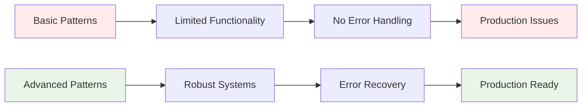

**Basic Pattern Limitations:**
- Limited error handling capabilities
- No human intervention mechanisms
- Poor scalability and performance
- Difficult to maintain and debug

**Advanced Pattern Benefits:**
- Robust error handling and recovery
- Human-in-the-loop capabilities
- Scalable and performant systems
- Maintainable and debuggable code

## Interrupts and Human-in-the-Loop

### 1. Interrupt Pattern

Interrupts allow human intervention at specific points in the workflow.

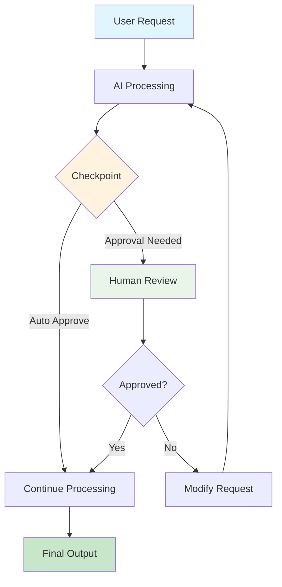

### 2. Checkpoint Pattern

Checkpoints allow you to save and resume workflow state.

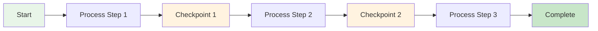

### 3. Human-in-the-Loop Flow

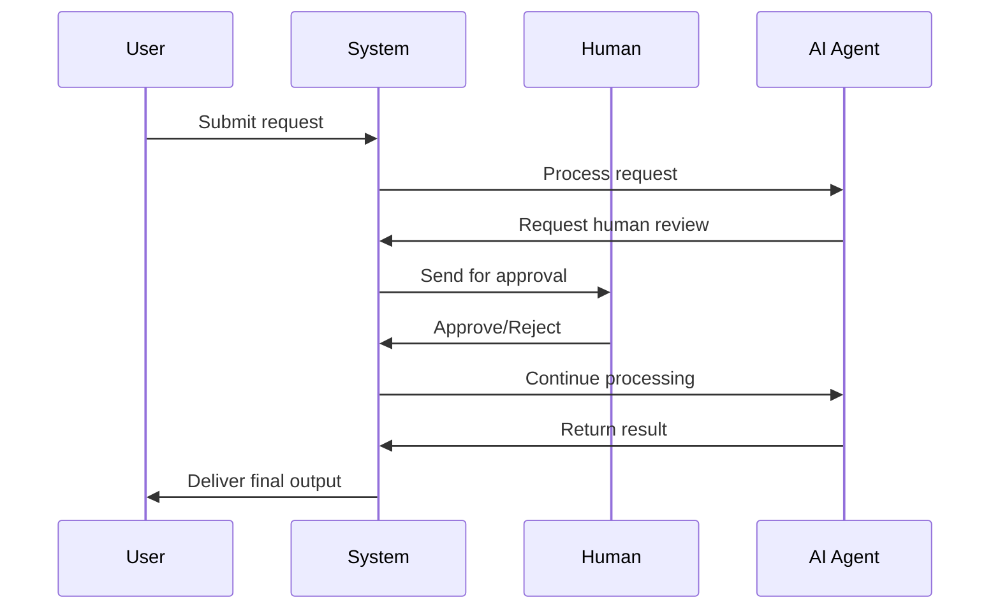

## Error Handling Patterns

### 1. Circuit Breaker Pattern

The circuit breaker prevents cascading failures by monitoring system health.

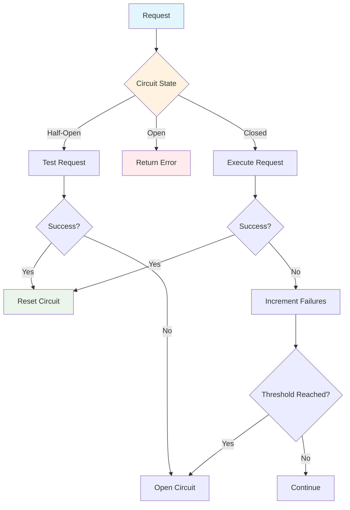

### 2. Retry Pattern

The retry pattern automatically retries failed operations with exponential backoff.

```mermaid
graph TD
    A[Request] --> B[Execute Operation]
    B --> C{Success?}
    C -->|Yes| D[Return Result]
    C -->|No| E[Increment Retry Count]
    E --> F{Max Retries?}
    F -->|No| G[Wait (Backoff)]
    G --> B
    F -->|Yes| H[Return Error]
    
    style A fill:#e1f5fe
    style D fill:#e8f5e8
    style H fill:#ffebee
    style G fill:#fff3e0
```

### 3. Fallback Pattern

The fallback pattern provides alternative responses when primary operations fail.

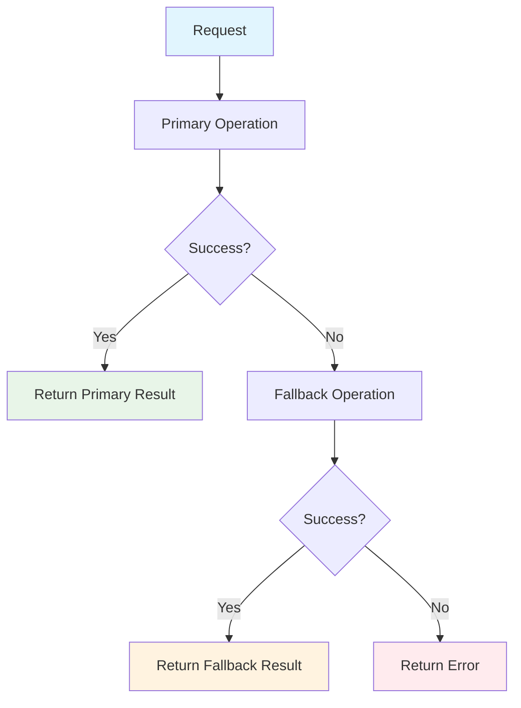

## State Management Patterns

### 1. State Persistence

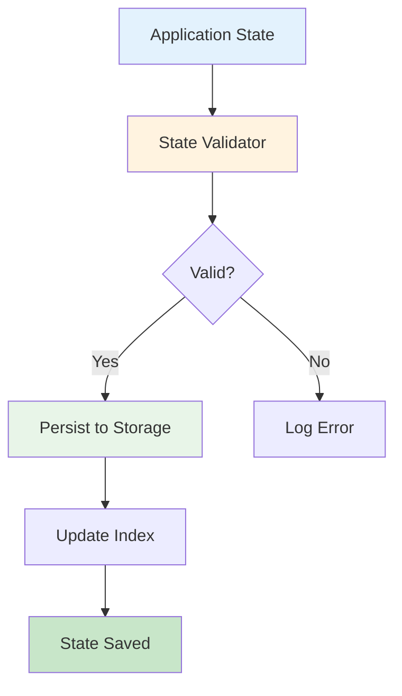

### 2. State Recovery

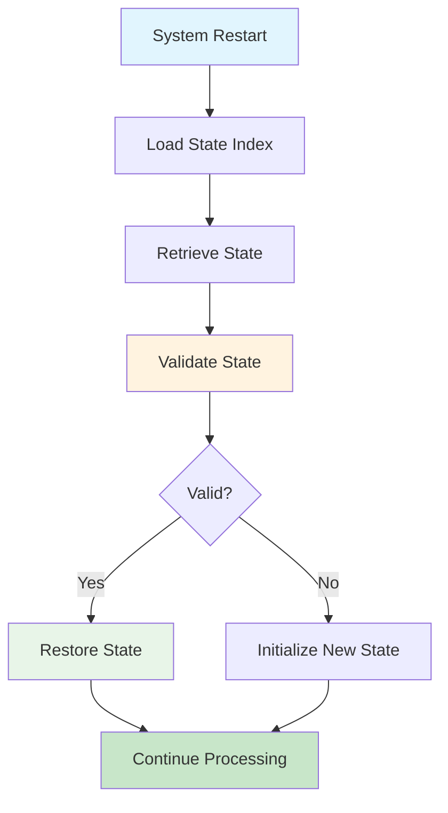

## Performance Optimization Patterns

### 1. Caching Strategy

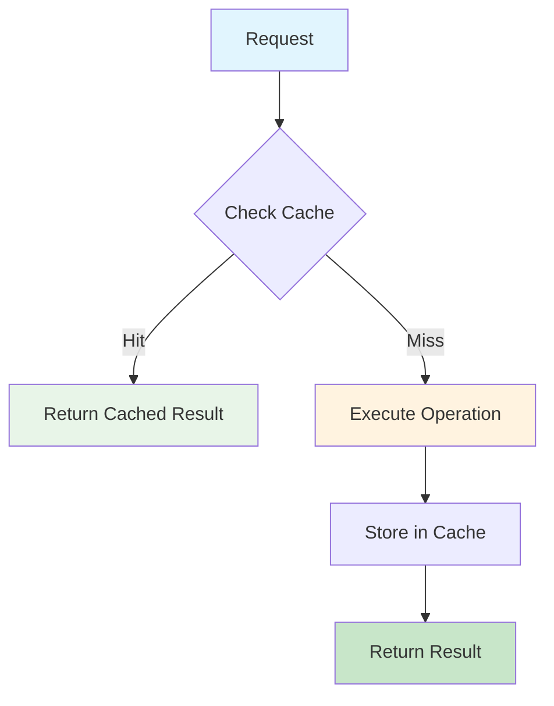

### 2. Parallel Processing

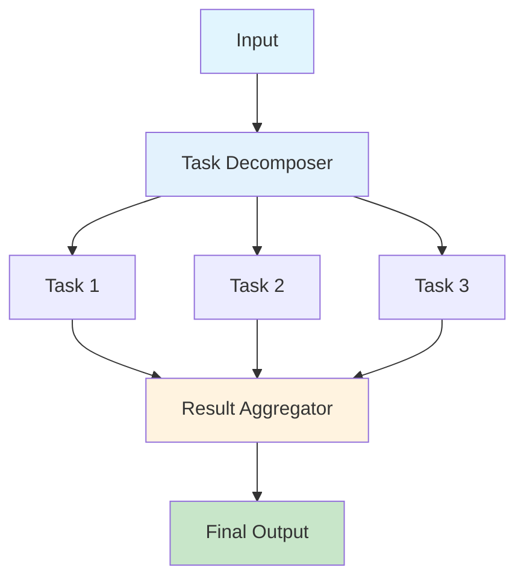

## Practical Example: Robust Customer Service System

Let's build a production-ready customer service system with advanced patterns.

### Step 1: Define the Advanced State

```python
from typing import TypedDict, Annotated, List, Dict, Optional
from langchain_core.messages import BaseMessage
from datetime import datetime
import asyncio
import time

class AdvancedServiceState(TypedDict):
    messages: Annotated[List[BaseMessage], "Conversation messages"]
    customer_id: Annotated[str, "Customer ID"]
    request_type: Annotated[str, "Type of request"]
    processing_stage: Annotated[str, "Current processing stage"]
    error_count: Annotated[int, "Number of errors encountered"]
    retry_count: Annotated[int, "Number of retries attempted"]
    human_intervention: Annotated[bool, "Whether human intervention is needed"]
    checkpoint_data: Annotated[Dict, "Checkpoint data for recovery"]
    next: Annotated[str, "Next action"]
```

### Step 2: Implement Circuit Breaker

```python
class CircuitBreaker:
    def __init__(self, failure_threshold: int = 5, recovery_timeout: int = 60):
        self.failure_threshold = failure_threshold
        self.recovery_timeout = recovery_timeout
        self.failure_count = 0
        self.last_failure_time = None
        self.state = "CLOSED"  # CLOSED, OPEN, HALF_OPEN
    
    def call(self, func, *args, **kwargs):
        """Execute function with circuit breaker protection."""
        if self.state == "OPEN":
            if time.time() - self.last_failure_time > self.recovery_timeout:
                self.state = "HALF_OPEN"
            else:
                raise Exception("Circuit breaker is OPEN")
        
        try:
            result = func(*args, **kwargs)
            if self.state == "HALF_OPEN":
                self.state = "CLOSED"
                self.failure_count = 0
            return result
        except Exception as e:
            self.failure_count += 1
            self.last_failure_time = time.time()
            
            if self.failure_count >= self.failure_threshold:
                self.state = "OPEN"
            
            raise e

# Usage
circuit_breaker = CircuitBreaker()
```

### Step 3: Implement Retry Pattern

```python
import random
from functools import wraps

def retry_with_backoff(max_retries: int = 3, base_delay: float = 1.0):
    """Retry decorator with exponential backoff."""
    def decorator(func):
        @wraps(func)
        def wrapper(*args, **kwargs):
            last_exception = None
            
            for attempt in range(max_retries + 1):
                try:
                    return func(*args, **kwargs)
                except Exception as e:
                    last_exception = e
                    
                    if attempt == max_retries:
                        raise last_exception
                    
                    # Exponential backoff with jitter
                    delay = base_delay * (2 ** attempt) + random.uniform(0, 1)
                    time.sleep(delay)
            
            raise last_exception
        return wrapper
    return decorator

@retry_with_backoff(max_retries=3)
def unreliable_operation():
    """Simulate an unreliable operation."""
    if random.random() < 0.7:  # 70% failure rate
        raise Exception("Operation failed")
    return "Operation succeeded"
```

### Step 4: Implement Checkpoint System

```python
import pickle
import os
from pathlib import Path

class CheckpointManager:
    def __init__(self, checkpoint_dir: str = "checkpoints"):
        self.checkpoint_dir = Path(checkpoint_dir)
        self.checkpoint_dir.mkdir(exist_ok=True)
    
    def save_checkpoint(self, state: AdvancedServiceState, checkpoint_id: str):
        """Save state to a checkpoint file."""
        checkpoint_data = {
            "state": state,
            "timestamp": datetime.now().isoformat(),
            "checkpoint_id": checkpoint_id
        }
        
        filepath = self.checkpoint_dir / f"{checkpoint_id}.pkl"
        with open(filepath, 'wb') as f:
            pickle.dump(checkpoint_data, f)
    
    def load_checkpoint(self, checkpoint_id: str) -> Optional[AdvancedServiceState]:
        """Load state from a checkpoint file."""
        filepath = self.checkpoint_dir / f"{checkpoint_id}.pkl"
        
        if filepath.exists():
            with open(filepath, 'rb') as f:
                checkpoint_data = pickle.load(f)
                return checkpoint_data["state"]
        
        return None
    
    def delete_checkpoint(self, checkpoint_id: str):
        """Delete a checkpoint file."""
        filepath = self.checkpoint_dir / f"{checkpoint_id}.pkl"
        if filepath.exists():
            filepath.unlink()

# Usage
checkpoint_manager = CheckpointManager()
```

### Step 5: Implement Human-in-the-Loop

```python
class HumanInterventionManager:
    def __init__(self):
        self.intervention_queue = []
        self.approved_requests = {}
    
    def request_human_approval(self, request_id: str, request_data: dict) -> str:
        """Request human approval for a specific request."""
        intervention_request = {
            "request_id": request_id,
            "request_data": request_data,
            "timestamp": datetime.now().isoformat(),
            "status": "pending"
        }
        
        self.intervention_queue.append(intervention_request)
        
        # In a real system, this would notify human agents
        print(f"Human approval requested for request {request_id}")
        
        return "waiting_for_approval"
    
    def approve_request(self, request_id: str, approved: bool, notes: str = ""):
        """Approve or reject a request."""
        self.approved_requests[request_id] = {
            "approved": approved,
            "notes": notes,
            "timestamp": datetime.now().isoformat()
        }
    
    def check_approval_status(self, request_id: str) -> Optional[dict]:
        """Check the approval status of a request."""
        return self.approved_requests.get(request_id)

# Usage
human_manager = HumanInterventionManager()
```

### Step 6: Create the Advanced Graph

```python
def create_advanced_service_graph():
    """Create a robust customer service workflow with advanced patterns."""
    workflow = StateGraph(AdvancedServiceState)
    
    # Add nodes with advanced patterns
    workflow.add_node("process_request", process_with_circuit_breaker)
    workflow.add_node("handle_error", handle_error_with_retry)
    workflow.add_node("request_human_approval", request_human_intervention)
    workflow.add_node("check_approval", check_human_approval)
    workflow.add_node("save_checkpoint", save_workflow_checkpoint)
    workflow.add_node("recover_from_checkpoint", recover_workflow_state)
    
    # Set entry point
    workflow.set_entry_point("process_request")
    
    # Add conditional edges for error handling and human intervention
    workflow.add_conditional_edges(
        "process_request",
        lambda state: state.get("next", "complete"),
        {
            "error": "handle_error",
            "human_approval_needed": "request_human_approval",
            "checkpoint": "save_checkpoint",
            "complete": END
        }
    )
    
    workflow.add_conditional_edges(
        "handle_error",
        lambda state: state.get("next", "complete"),
        {
            "retry": "process_request",
            "human_intervention": "request_human_approval",
            "fail": END
        }
    )
    
    workflow.add_edge("request_human_approval", "check_approval")
    workflow.add_edge("check_approval", "process_request")
    workflow.add_edge("save_checkpoint", "process_request")
    
    return workflow.compile()

def process_with_circuit_breaker(state: AdvancedServiceState) -> AdvancedServiceState:
    """Process request with circuit breaker protection."""
    try:
        # Simulate processing with potential failure
        result = circuit_breaker.call(unreliable_operation)
        
        return {
            **state,
            "processing_stage": "completed",
            "next": "complete"
        }
    except Exception as e:
        return {
            **state,
            "error_count": state["error_count"] + 1,
            "next": "error"
        }

def handle_error_with_retry(state: AdvancedServiceState) -> AdvancedServiceState:
    """Handle errors with retry logic."""
    retry_count = state["retry_count"]
    
    if retry_count < 3:
        return {
            **state,
            "retry_count": retry_count + 1,
            "next": "retry"
        }
    else:
        return {
            **state,
            "human_intervention": True,
            "next": "human_intervention"
        }

def request_human_intervention(state: AdvancedServiceState) -> AdvancedServiceState:
    """Request human intervention for complex cases."""
    request_id = f"req_{int(time.time())}"
    
    human_manager.request_human_approval(
        request_id,
        {"customer_id": state["customer_id"], "request_type": state["request_type"]}
    )
    
    return {
        **state,
        "next": "waiting_for_approval"
    }

def check_human_approval(state: AdvancedServiceState) -> AdvancedServiceState:
    """Check if human approval has been received."""
    # In a real system, this would check the approval status
    # For demo purposes, we'll simulate approval
    return {
        **state,
        "next": "process_request"
    }

def save_workflow_checkpoint(state: AdvancedServiceState) -> AdvancedServiceState:
    """Save workflow state to checkpoint."""
    checkpoint_id = f"checkpoint_{state['customer_id']}_{int(time.time())}"
    checkpoint_manager.save_checkpoint(state, checkpoint_id)
    
    return {
        **state,
        "checkpoint_data": {"checkpoint_id": checkpoint_id},
        "next": "process_request"
    }

# Usage
app = create_advanced_service_graph()

# Initialize state
initial_state = {
    "messages": [HumanMessage(content="I need help with a complex technical issue")],
    "customer_id": "CUST123",
    "request_type": "technical_support",
    "processing_stage": "initial",
    "error_count": 0,
    "retry_count": 0,
    "human_intervention": False,
    "checkpoint_data": {},
    "next": ""
}

# Run the advanced system
result = app.invoke(initial_state)
```

## Integration Patterns

### 1. External API Integration

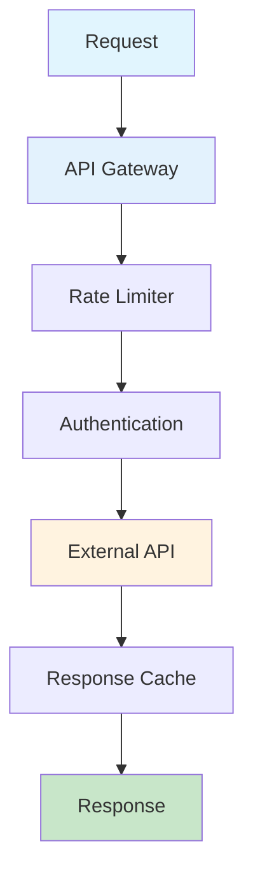

### 2. Database Integration

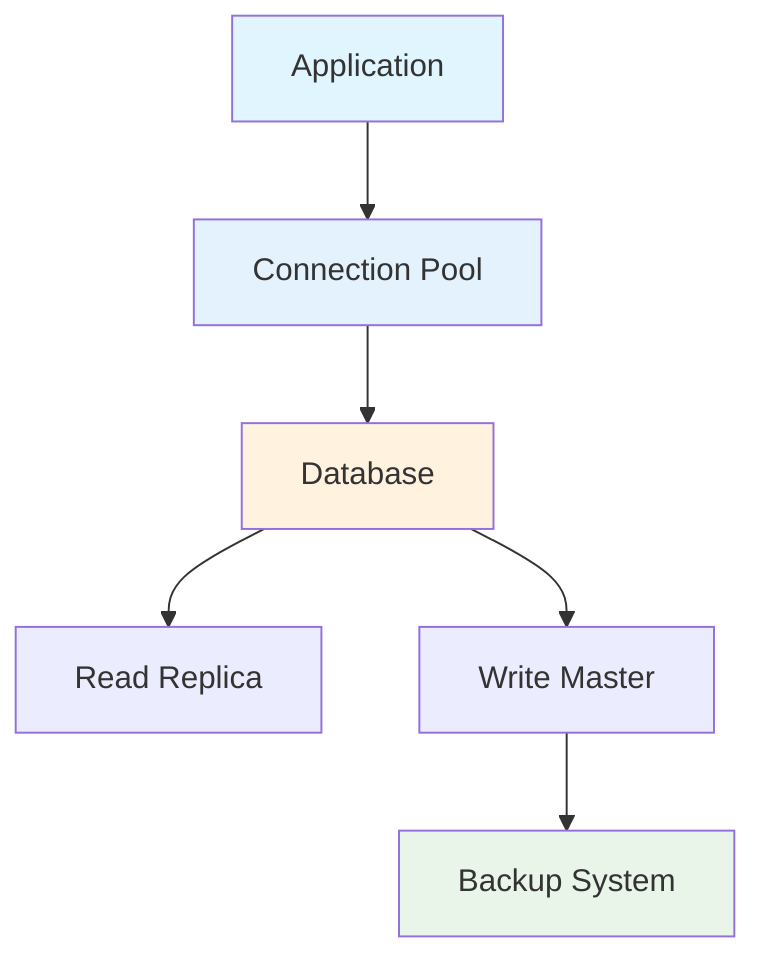

### 3. Monitoring and Observability

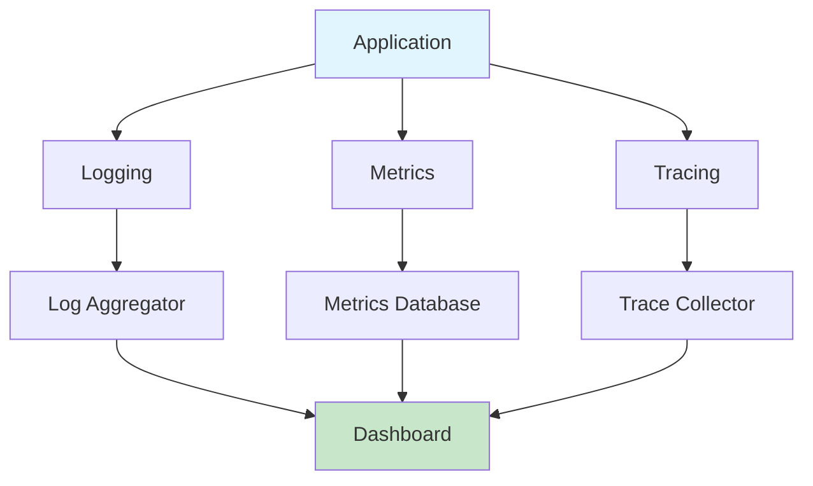

## Interactive Exercises

### Exercise 1: Circuit Breaker Implementation

**Challenge**: Implement a more sophisticated circuit breaker with different failure types.

<details>
<summary>Starter Code</summary>

```python
class AdvancedCircuitBreaker:
    def __init__(self, failure_threshold: int = 5, recovery_timeout: int = 60):
        self.failure_threshold = failure_threshold
        self.recovery_timeout = recovery_timeout
        self.failure_count = 0
        self.last_failure_time = None
        self.state = "CLOSED"
        self.failure_types = {}  # Track different types of failures
    
    def call(self, func, *args, **kwargs):
        """Execute function with advanced circuit breaker protection."""
        # Your advanced circuit breaker logic here
        pass
```
</details>

### Exercise 2: Distributed Checkpointing

**Challenge**: Implement distributed checkpointing across multiple nodes.

<details>
<summary>Solution</summary>

```python
class DistributedCheckpointManager:
    def __init__(self, storage_backend: str = "redis"):
        self.storage_backend = storage_backend
        self.node_id = f"node_{os.getpid()}"
    
    def save_distributed_checkpoint(self, state: dict, checkpoint_id: str):
        """Save checkpoint to distributed storage."""
        checkpoint_data = {
            "state": state,
            "node_id": self.node_id,
            "timestamp": datetime.now().isoformat(),
            "checkpoint_id": checkpoint_id
        }
        
        # In a real implementation, this would use Redis, MongoDB, etc.
        print(f"Saving checkpoint {checkpoint_id} to {self.storage_backend}")
    
    def load_distributed_checkpoint(self, checkpoint_id: str) -> Optional[dict]:
        """Load checkpoint from distributed storage."""
        # In a real implementation, this would retrieve from distributed storage
        print(f"Loading checkpoint {checkpoint_id} from {self.storage_backend}")
        return None
```
</details>

### Exercise 3: Advanced Human-in-the-Loop

**Challenge**: Implement a sophisticated human-in-the-loop system with role-based approvals.

<details>
<summary>Advanced Solution</summary>

```python
class RoleBasedApprovalSystem:
    def __init__(self):
        self.approval_workflows = {
            "technical_issue": ["tech_support", "senior_tech"],
            "billing_issue": ["billing_agent", "billing_manager"],
            "security_issue": ["security_analyst", "security_manager", "compliance_officer"]
        }
        self.approval_status = {}
    
    def request_approval(self, request_type: str, request_data: dict) -> str:
        """Request approval based on request type and workflow."""
        workflow = self.approval_workflows.get(request_type, ["general_agent"])
        request_id = f"req_{int(time.time())}"
        
        self.approval_status[request_id] = {
            "workflow": workflow,
            "current_step": 0,
            "approvals": [],
            "request_data": request_data,
            "status": "pending"
        }
        
        return request_id
    
    def approve_step(self, request_id: str, approver_role: str, approved: bool):
        """Approve or reject a specific step in the workflow."""
        if request_id not in self.approval_status:
            raise ValueError(f"Request {request_id} not found")
        
        status = self.approval_status[request_id]
        workflow = status["workflow"]
        current_step = status["current_step"]
        
        if approver_role != workflow[current_step]:
            raise ValueError(f"Invalid approver role: {approver_role}")
        
        status["approvals"].append({
            "role": approver_role,
            "approved": approved,
            "timestamp": datetime.now().isoformat()
        })
        
        if approved and current_step < len(workflow) - 1:
            status["current_step"] += 1
        elif not approved:
            status["status"] = "rejected"
        else:
            status["status"] = "approved"
```
</details>

## Step-by-Step Walkthrough

Let's trace through an advanced pattern workflow:

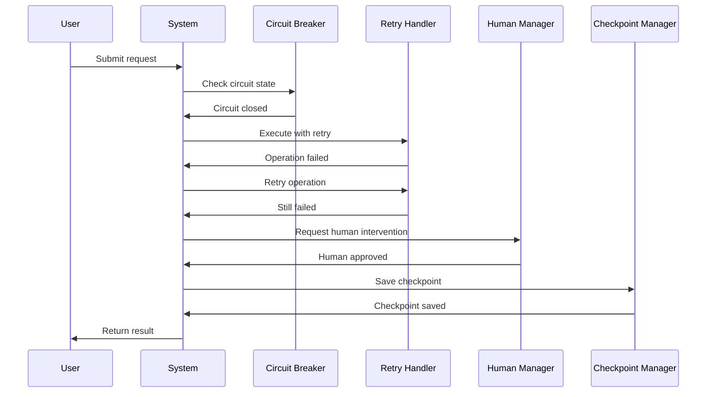

**Detailed Flow:**
1. **User Request**: Submit complex request
2. **Circuit Breaker**: Check if system is healthy
3. **Retry Logic**: Attempt operation with backoff
4. **Human Intervention**: Request approval for complex cases
5. **Checkpointing**: Save state for recovery
6. **Result Delivery**: Return processed result

## Key Takeaways

### What You've Learned
- **Advanced Error Handling**: Circuit breakers, retries, and fallbacks
- **Human-in-the-Loop**: Checkpoints and approval workflows
- **Performance Optimization**: Caching and parallel processing
- **Production Readiness**: Monitoring and observability

### Next Steps
- **Real-World Applications**: Apply patterns to production systems
- **Advanced Monitoring**: Implement comprehensive observability
- **Scalability**: Design for high-throughput applications

### Best Practices
- **Defensive Programming**: Always handle errors gracefully
- **Observability**: Monitor system health and performance
- **Human Oversight**: Provide human intervention capabilities
- **State Management**: Implement robust checkpointing and recovery

## Troubleshooting

### Common Issues

**Issue**: "Circuit breaker stuck open"
- **Solution**: Implement proper recovery mechanisms and monitoring

**Issue**: "Checkpoint corruption"
- **Solution**: Add validation and backup strategies

**Issue**: "Human approval bottlenecks"
- **Solution**: Implement role-based approvals and escalation

### Debugging Tips

```python
# Add advanced debugging
def debug_advanced_patterns(state: AdvancedServiceState, pattern_name: str):
    """Debug advanced pattern execution."""
    print(f"Pattern: {pattern_name}")
    print(f"Error count: {state.get('error_count', 0)}")
    print(f"Retry count: {state.get('retry_count', 0)}")
    print(f"Human intervention: {state.get('human_intervention', False)}")
    print(f"Processing stage: {state.get('processing_stage', 'unknown')}")
    print("-" * 50)

# Enhanced error handling with debugging
def safe_advanced_execution(func, state: AdvancedServiceState, pattern_name: str):
    """Execute advanced pattern with debugging and error handling."""
    try:
        debug_advanced_patterns(state, pattern_name)
        result = func(state)
        return result
    except Exception as e:
        print(f"Advanced pattern {pattern_name} failed: {e}")
        return state  # Return original state on error
```

## Try It Yourself!

**Interactive Challenge**: Build a robust e-commerce order processing system that:
1. Handles payment failures with circuit breakers
2. Implements human approval for high-value orders
3. Uses checkpoints for order recovery
4. Provides comprehensive monitoring and alerting

<details>
<summary>Starter Template</summary>

```python
class OrderProcessingState(TypedDict):
    order_id: Annotated[str, "Order ID"]
    customer_id: Annotated[str, "Customer ID"]
    order_amount: Annotated[float, "Order amount"]
    payment_status: Annotated[str, "Payment status"]
    processing_stage: Annotated[str, "Processing stage"]
    error_count: Annotated[int, "Error count"]
    human_approval_needed: Annotated[bool, "Human approval needed"]
    next: Annotated[str, "Next action"]

class PaymentProcessor:
    def process_payment(self, state: OrderProcessingState) -> OrderProcessingState:
        """Process payment with circuit breaker protection."""
        # Your payment processing logic here
        pass

class OrderApprovalManager:
    def check_approval_required(self, state: OrderProcessingState) -> bool:
        """Check if order requires human approval."""
        # Your approval logic here
        pass
```
</details>

---

**Ready for the next level?** Continue to [Real-World Examples](./06-practical-examples.md) to see these patterns in action! 