# Practical Examples and Real-World Applications

## Introduction

This tutorial provides practical, real-world examples of LangGraph applications. These examples demonstrate how to apply the concepts learned in previous tutorials to solve actual problems.

## Example 1: E-commerce Customer Service Bot

### Problem Statement
Build a customer service bot for an e-commerce platform that can:
- Handle order inquiries
- Process returns and refunds
- Provide product recommendations
- Escalate complex issues to humans

### System Architecture

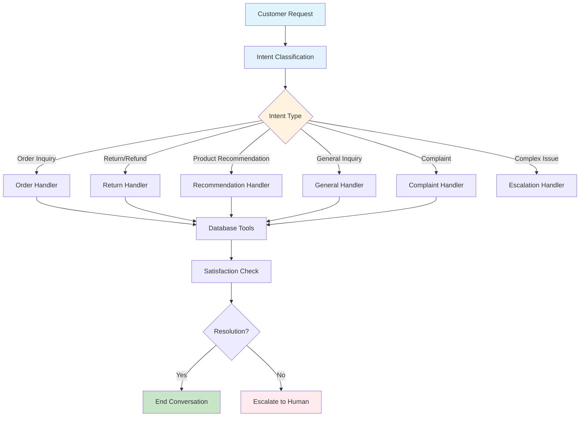

### Workflow Diagram

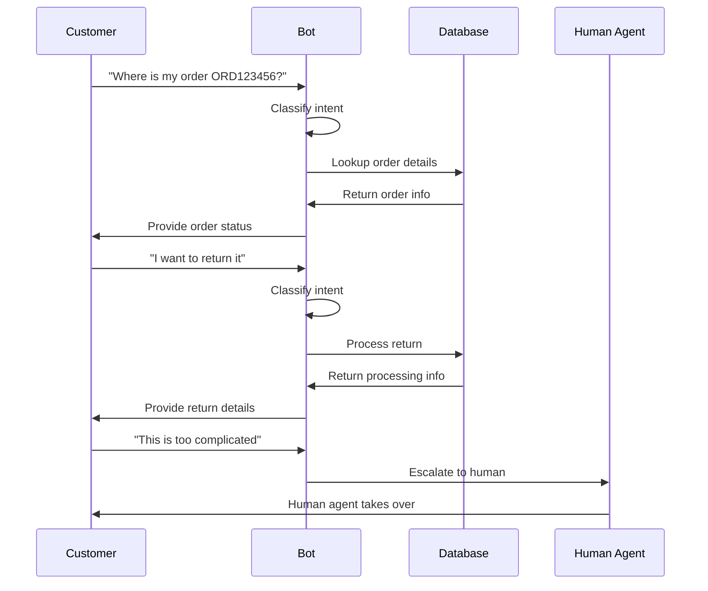

### Key Components

```python
from typing import TypedDict, Annotated, List, Optional
from langchain_core.messages import BaseMessage, HumanMessage, AIMessage
from langchain_core.tools import tool
from langgraph.graph import StateGraph, END
from langchain_anthropic import ChatAnthropic
import json
import sqlite3

class EcommerceState(TypedDict):
    messages: Annotated[List[BaseMessage], "Conversation messages"]
    customer_id: Annotated[Optional[str], "Customer ID"]
    order_id: Annotated[Optional[str], "Order ID"]
    issue_type: Annotated[Optional[str], "Type of issue"]
    escalation_level: Annotated[int, "Escalation level (0-3)"]
    context: Annotated[dict, "Additional context"]
    next: Annotated[str, "Next action"]

# Tools for e-commerce operations
@tool
def lookup_customer(customer_id: str) -> str:
    """Look up customer information and order history."""
    # Simulate database lookup
    customer_data = {
        "customer_id": customer_id,
        "name": "John Doe",
        "email": "john@example.com",
        "total_orders": 15,
        "lifetime_value": 2500.00,
        "last_order_date": "2024-01-15"
    }
    return json.dumps(customer_data)

@tool
def lookup_order(order_id: str) -> str:
    """Look up order details and status."""
    # Simulate database lookup
    order_data = {
        "order_id": order_id,
        "status": "shipped",
        "items": [
            {"name": "Wireless Headphones", "quantity": 1, "price": 99.99},
            {"name": "Phone Case", "quantity": 2, "price": 19.99}
        ],
        "total": 139.97,
        "shipping_address": "123 Main St, City, State 12345",
        "estimated_delivery": "2024-01-20"
    }
    return json.dumps(order_data)

@tool
def process_return(order_id: str, reason: str) -> str:
    """Process a return request."""
    # Simulate return processing
    return_data = {
        "return_id": f"RET_{order_id}",
        "status": "approved",
        "refund_amount": 139.97,
        "return_label": "https://shipping.com/label/12345",
        "estimated_refund_time": "5-7 business days"
    }
    return json.dumps(return_data)

@tool
def get_product_recommendations(category: str, budget: float) -> str:
    """Get product recommendations based on category and budget."""
    # Simulate recommendation engine
    recommendations = {
        "category": category,
        "budget": budget,
        "products": [
            {"name": "Premium Wireless Earbuds", "price": 89.99, "rating": 4.8},
            {"name": "Bluetooth Speaker", "price": 79.99, "rating": 4.6},
            {"name": "Phone Stand", "price": 24.99, "rating": 4.5}
        ]
    }
    return json.dumps(recommendations)

# Node functions
def classify_intent(state: EcommerceState) -> EcommerceState:
    """Classify the customer's intent."""
    messages = state["messages"]
    llm = ChatAnthropic(model="claude-3-sonnet-20240229")
    
    system_prompt = """
    Classify the customer's intent into one of these categories:
    - order_inquiry: Questions about orders, tracking, delivery
    - return_refund: Return or refund requests
    - product_recommendation: Looking for product suggestions
    - general_inquiry: General questions about the company
    - complaint: Complaints or issues
    - escalation: Complex issues requiring human intervention
    
    Respond with just the category name.
    """
    
    response = llm.invoke([{"role": "system", "content": system_prompt}] + messages)
    issue_type = response.content.strip().lower()
    
    return {
        **state,
        "issue_type": issue_type,
        "next": "route_by_intent"
    }

def route_by_intent(state: EcommerceState) -> str:
    """Route to appropriate handler based on intent."""
    issue_type = state["issue_type"]
    
    routing_map = {
        "order_inquiry": "order_handler",
        "return_refund": "return_handler",
        "product_recommendation": "recommendation_handler",
        "general_inquiry": "general_handler",
        "complaint": "complaint_handler",
        "escalation": "escalation_handler"
    }
    
    return routing_map.get(issue_type, "general_handler")

def order_handler(state: EcommerceState) -> EcommerceState:
    """Handle order-related inquiries."""
    messages = state["messages"]
    llm = ChatAnthropic(model="claude-3-sonnet-20240229")
    
    # Extract order ID if mentioned
    last_message = messages[-1].content.lower()
    order_id = None
    if "order" in last_message and any(char.isdigit() for char in last_message):
        # Simple extraction - in practice, use regex or NER
        order_id = "ORD123456"
    
    if order_id:
        # Look up order details
        order_info = lookup_order(order_id)
        context = f"Order information: {order_info}"
    else:
        context = "No specific order mentioned"
    
    system_prompt = f"""
    You are an order support specialist. Help customers with order inquiries.
    
    {context}
    
    Be helpful, accurate, and professional. If you need more information, ask for it.
    """
    
    response = llm.invoke([{"role": "system", "content": system_prompt}] + messages)
    
    return {
        **state,
        "messages": messages + [response],
        "order_id": order_id,
        "next": "check_satisfaction"
    }

def return_handler(state: EcommerceState) -> EcommerceState:
    """Handle return and refund requests."""
    messages = state["messages"]
    llm = ChatAnthropic(model="claude-3-sonnet-20240229")
    
    # Extract order ID and reason
    last_message = messages[-1].content.lower()
    order_id = "ORD123456"  # Simplified extraction
    reason = "Customer request"  # Simplified extraction
    
    # Process return
    return_info = process_return(order_id, reason)
    
    system_prompt = f"""
    You are a returns specialist. Help customers with returns and refunds.
    
    Return information: {return_info}
    
    Be empathetic and helpful. Explain the return process clearly.
    """
    
    response = llm.invoke([{"role": "system", "content": system_prompt}] + messages)
    
    return {
        **state,
        "messages": messages + [response],
        "order_id": order_id,
        "next": "check_satisfaction"
    }

def recommendation_handler(state: EcommerceState) -> EcommerceState:
    """Handle product recommendation requests."""
    messages = state["messages"]
    llm = ChatAnthropic(model="claude-3-sonnet-20240229")
    
    # Extract category and budget preferences
    last_message = messages[-1].content.lower()
    category = "electronics"  # Simplified extraction
    budget = 100.0  # Simplified extraction
    
    # Get recommendations
    recommendations = get_product_recommendations(category, budget)
    
    system_prompt = f"""
    You are a product recommendation specialist. Help customers find products.
    
    Recommendations: {recommendations}
    
    Be enthusiastic and helpful. Explain why you're recommending each product.
    """
    
    response = llm.invoke([{"role": "system", "content": system_prompt}] + messages)
    
    return {
        **state,
        "messages": messages + [response],
        "next": "check_satisfaction"
    }

def general_handler(state: EcommerceState) -> EcommerceState:
    """Handle general inquiries."""
    messages = state["messages"]
    llm = ChatAnthropic(model="claude-3-sonnet-20240229")
    
    system_prompt = """
    You are a general customer service representative. Help customers with general inquiries.
    
    Be friendly, helpful, and professional. If you can't help, offer to escalate.
    """
    
    response = llm.invoke([{"role": "system", "content": system_prompt}] + messages)
    
    return {
        **state,
        "messages": messages + [response],
        "next": "check_satisfaction"
    }

def complaint_handler(state: EcommerceState) -> EcommerceState:
    """Handle customer complaints."""
    messages = state["messages"]
    llm = ChatAnthropic(model="claude-3-sonnet-20240229")
    
    system_prompt = """
    You are a complaint resolution specialist. Handle customer complaints empathetically.
    
    Listen to their concerns, acknowledge their feelings, and work toward a resolution.
    If the complaint is complex, offer to escalate to a human agent.
    """
    
    response = llm.invoke([{"role": "system", "content": system_prompt}] + messages)
    
    return {
        **state,
        "messages": messages + [response],
        "escalation_level": state["escalation_level"] + 1,
        "next": "check_satisfaction"
    }

def escalation_handler(state: EcommerceState) -> EcommerceState:
    """Handle escalation to human agents."""
    messages = state["messages"]
    llm = ChatAnthropic(model="claude-3-sonnet-20240229")
    
    system_prompt = """
    You are handling a complex issue that requires human intervention.
    
    Acknowledge the complexity of the issue and explain that you're connecting them with a human agent.
    Provide a brief summary of the conversation for the human agent.
    """
    
    response = llm.invoke([{"role": "system", "content": system_prompt}] + messages)
    
    return {
        **state,
        "messages": messages + [response],
        "escalation_level": 3,
        "next": "end"
    }

def check_satisfaction(state: EcommerceState) -> EcommerceState:
    """Check if the customer is satisfied with the resolution."""
    messages = state["messages"]
    escalation_level = state["escalation_level"]
    
    # Simple satisfaction check - in practice, use sentiment analysis
    if escalation_level >= 2:
        return {
            **state,
            "next": "escalation_handler"
        }
    
    return {
        **state,
        "next": "end"
    }

# Create the e-commerce graph
def create_ecommerce_graph():
    """Create the e-commerce customer service workflow."""
    workflow = StateGraph(EcommerceState)
    
    # Add nodes
    workflow.add_node("classify_intent", classify_intent)
    workflow.add_node("order_handler", order_handler)
    workflow.add_node("return_handler", return_handler)
    workflow.add_node("recommendation_handler", recommendation_handler)
    workflow.add_node("general_handler", general_handler)
    workflow.add_node("complaint_handler", complaint_handler)
    workflow.add_node("escalation_handler", escalation_handler)
    workflow.add_node("check_satisfaction", check_satisfaction)
    
    # Set entry point
    workflow.set_entry_point("classify_intent")
    
    # Add conditional edges
    workflow.add_conditional_edges(
        "classify_intent",
        route_by_intent,
        {
            "order_handler": "order_handler",
            "return_handler": "return_handler",
            "recommendation_handler": "recommendation_handler",
            "general_handler": "general_handler",
            "complaint_handler": "complaint_handler",
            "escalation_handler": "escalation_handler"
        }
    )
    
    # Add edges to satisfaction check
    workflow.add_edge("order_handler", "check_satisfaction")
    workflow.add_edge("return_handler", "check_satisfaction")
    workflow.add_edge("recommendation_handler", "check_satisfaction")
    workflow.add_edge("general_handler", "check_satisfaction")
    workflow.add_edge("complaint_handler", "check_satisfaction")
    
    # Add conditional edges from satisfaction check
    workflow.add_conditional_edges(
        "check_satisfaction",
        lambda state: state["next"],
        {
            "escalation_handler": "escalation_handler",
            "end": END
        }
    )
    
    workflow.add_edge("escalation_handler", END)
    
    return workflow.compile()

# Usage
ecommerce_app = create_ecommerce_graph()

# Example usage
initial_state = {
    "messages": [HumanMessage(content="Where is my order ORD123456?")],
    "customer_id": None,
    "order_id": None,
    "issue_type": None,
    "escalation_level": 0,
    "context": {},
    "next": ""
}

result = ecommerce_app.invoke(initial_state)
```

## Example 2: Content Moderation System

### Problem Statement
Build a content moderation system that can:
- Analyze text for inappropriate content
- Detect spam and malicious links
- Route content for human review when needed
- Maintain compliance with platform policies

### System Architecture

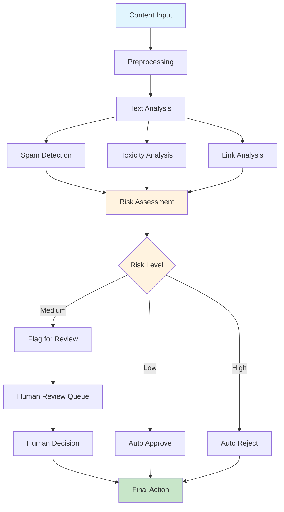

### Content Analysis Flow

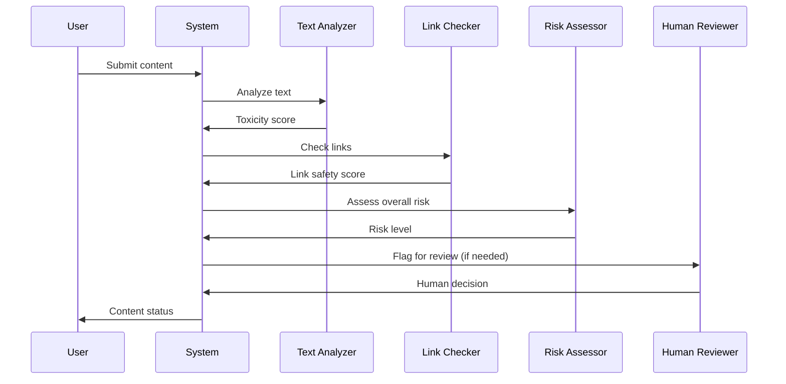

### Key Components

```python
class ContentModerationState(TypedDict):
    content: Annotated[str, "Content to moderate"]
    content_type: Annotated[str, "Type of content (text, image, video)"]
    user_id: Annotated[str, "User who submitted content"]
    analysis_results: Annotated[dict, "Analysis results from various tools"]
    risk_score: Annotated[float, "Overall risk score (0-1)"]
    moderation_action: Annotated[str, "Action taken (approve, reject, review)"]
    human_review_needed: Annotated[bool, "Whether human review is needed"]
    next: Annotated[str, "Next action"]

@tool
def analyze_toxicity(text: str) -> str:
    """Analyze text for toxic content."""
    # Simulate toxicity analysis
    toxicity_score = 0.3  # In practice, use a real toxicity detection model
    toxic_categories = ["hate_speech", "harassment"] if toxicity_score > 0.5 else []
    
    return json.dumps({
        "toxicity_score": toxicity_score,
        "toxic_categories": toxic_categories,
        "confidence": 0.85
    })

@tool
def detect_spam(text: str) -> str:
    """Detect spam content."""
    # Simulate spam detection
    spam_indicators = ["buy now", "limited time", "click here"]
    spam_score = sum(1 for indicator in spam_indicators if indicator in text.lower()) / len(spam_indicators)
    
    return json.dumps({
        "spam_score": spam_score,
        "is_spam": spam_score > 0.5,
        "spam_indicators": [indicator for indicator in spam_indicators if indicator in text.lower()]
    })

@tool
def check_links(text: str) -> str:
    """Check links for malicious content."""
    # Simulate link checking
    import re
    links = re.findall(r'http[s]?://(?:[a-zA-Z]|[0-9]|[$-_@.&+]|[!*\\(\\),]|(?:%[0-9a-fA-F][0-9a-fA-F]))+', text)
    
    link_analysis = []
    for link in links:
        # Simulate link safety check
        is_safe = "malicious" not in link.lower()
        link_analysis.append({
            "url": link,
            "is_safe": is_safe,
            "threat_level": "high" if not is_safe else "low"
        })
    
    return json.dumps({
        "links_found": len(links),
        "safe_links": sum(1 for link in link_analysis if link["is_safe"]),
        "malicious_links": sum(1 for link in link_analysis if not link["is_safe"]),
        "link_analysis": link_analysis
    })

def analyze_content(state: ContentModerationState) -> ContentModerationState:
    """Analyze content using multiple tools."""
    content = state["content"]
    
    # Run analysis tools
    toxicity_result = analyze_toxicity(content)
    spam_result = detect_spam(content)
    link_result = check_links(content)
    
    # Parse results
    toxicity_data = json.loads(toxicity_result)
    spam_data = json.loads(spam_result)
    link_data = json.loads(link_result)
    
    # Calculate overall risk score
    risk_score = (
        toxicity_data["toxicity_score"] * 0.4 +
        spam_data["spam_score"] * 0.3 +
        (1 - link_data["safe_links"] / max(link_data["links_found"], 1)) * 0.3
    )
    
    return {
        **state,
        "analysis_results": {
            "toxicity": toxicity_data,
            "spam": spam_data,
            "links": link_data
        },
        "risk_score": risk_score,
        "next": "assess_risk"
    }

def assess_risk(state: ContentModerationState) -> ContentModerationState:
    """Assess risk and determine moderation action."""
    risk_score = state["risk_score"]
    
    if risk_score < 0.3:
        action = "approve"
        human_review = False
    elif risk_score < 0.7:
        action = "review"
        human_review = True
    else:
        action = "reject"
        human_review = False
    
    return {
        **state,
        "moderation_action": action,
        "human_review_needed": human_review,
        "next": "execute_action"
    }

def execute_action(state: ContentModerationState) -> ContentModerationState:
    """Execute the determined moderation action."""
    action = state["moderation_action"]
    human_review = state["human_review_needed"]
    
    if action == "approve":
        # Auto-approve content
        message = "Content approved automatically."
    elif action == "reject":
        # Auto-reject content
        message = "Content rejected due to policy violations."
    elif action == "review" and human_review:
        # Flag for human review
        message = "Content flagged for human review."
    
    return {
        **state,
        "next": "end"
    }

# Create the content moderation graph
def create_content_moderation_graph():
    """Create the content moderation workflow."""
    workflow = StateGraph(ContentModerationState)
    
    # Add nodes
    workflow.add_node("analyze_content", analyze_content)
    workflow.add_node("assess_risk", assess_risk)
    workflow.add_node("execute_action", execute_action)
    
    # Set entry point
    workflow.set_entry_point("analyze_content")
    
    # Add edges
    workflow.add_edge("analyze_content", "assess_risk")
    workflow.add_edge("assess_risk", "execute_action")
    workflow.add_edge("execute_action", END)
    
    return workflow.compile()

# Usage
moderation_app = create_content_moderation_graph()

# Example usage
initial_state = {
    "content": "This is a great product! Buy now at amazing prices!",
    "content_type": "text",
    "user_id": "user123",
    "analysis_results": {},
    "risk_score": 0.0,
    "moderation_action": "",
    "human_review_needed": False,
    "next": ""
}

result = moderation_app.invoke(initial_state)
```

## Example 3: Financial Advisory Bot

### Problem Statement
Build a financial advisory bot that can:
- Analyze user financial goals
- Provide investment recommendations
- Calculate retirement planning scenarios
- Ensure compliance with financial regulations

### System Architecture

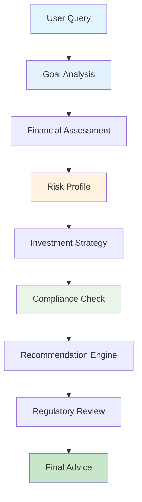

### Financial Planning Workflow

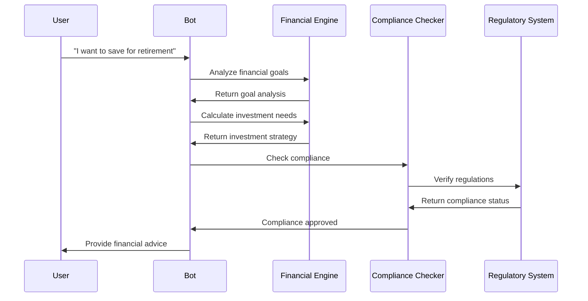

### Key Components

```python
class FinancialAdvisoryState(TypedDict):
    user_query: Annotated[str, "User's financial question"]
    user_profile: Annotated[dict, "User's financial profile"]
    goals: Annotated[list, "Financial goals"]
    risk_tolerance: Annotated[str, "User's risk tolerance"]
    investment_strategy: Annotated[dict, "Recommended investment strategy"]
    compliance_status: Annotated[str, "Compliance check status"]
    advice: Annotated[str, "Final financial advice"]
    next: Annotated[str, "Next action"]

@tool
def analyze_financial_goals(query: str) -> str:
    """Analyze user's financial goals from their query."""
    # Simulate goal analysis
    goals = []
    if "retirement" in query.lower():
        goals.append("retirement_savings")
    if "house" in query.lower() or "mortgage" in query.lower():
        goals.append("home_purchase")
    if "college" in query.lower() or "education" in query.lower():
        goals.append("education_funding")
    if "emergency" in query.lower():
        goals.append("emergency_fund")
    
    return json.dumps({
        "goals": goals,
        "time_horizon": "long_term" if "retirement" in query.lower() else "medium_term",
        "priority": "high" if len(goals) > 0 else "medium"
    })

@tool
def assess_risk_tolerance(age: int, income: float, goals: list) -> str:
    """Assess user's risk tolerance based on profile."""
    # Simulate risk assessment
    risk_factors = {
        "age": 1.0 if age < 30 else 0.7 if age < 50 else 0.4,
        "income_stability": 0.8,
        "goal_urgency": 0.6
    }
    
    overall_risk = sum(risk_factors.values()) / len(risk_factors)
    
    if overall_risk > 0.7:
        risk_tolerance = "aggressive"
    elif overall_risk > 0.4:
        risk_tolerance = "moderate"
    else:
        risk_tolerance = "conservative"
    
    return json.dumps({
        "risk_tolerance": risk_tolerance,
        "risk_score": overall_risk,
        "factors": risk_factors
    })

@tool
def calculate_investment_needs(goal: str, time_horizon: str, current_savings: float) -> str:
    """Calculate investment needs for specific goals."""
    # Simulate investment calculations
    goal_amounts = {
        "retirement_savings": 1000000,
        "home_purchase": 300000,
        "education_funding": 100000,
        "emergency_fund": 25000
    }
    
    target_amount = goal_amounts.get(goal, 100000)
    monthly_contribution = (target_amount - current_savings) / (12 * 20)  # 20 years
    
    return json.dumps({
        "goal": goal,
        "target_amount": target_amount,
        "current_savings": current_savings,
        "monthly_contribution": monthly_contribution,
        "time_horizon": time_horizon
    })

@tool
def check_compliance(advice: str, user_location: str) -> str:
    """Check if advice complies with financial regulations."""
    # Simulate compliance checking
    compliance_keywords = ["guarantee", "risk-free", "get rich quick"]
    has_compliance_issues = any(keyword in advice.lower() for keyword in compliance_keywords)
    
    return json.dumps({
        "compliant": not has_compliance_issues,
        "issues": compliance_keywords if has_compliance_issues else [],
        "regulations": ["SEC", "FINRA"] if user_location == "US" else ["local_regulations"]
    })

def analyze_user_query(state: FinancialAdvisoryState) -> FinancialAdvisoryState:
    """Analyze the user's financial query."""
    query = state["user_query"]
    
    # Analyze goals
    goals_result = analyze_financial_goals(query)
    goals_data = json.loads(goals_result)
    
    return {
        **state,
        "goals": goals_data["goals"],
        "next": "assess_profile"
    }

def assess_user_profile(state: FinancialAdvisoryState) -> FinancialAdvisoryState:
    """Assess user's financial profile and risk tolerance."""
    goals = state["goals"]
    
    # Simulate user profile (in practice, this would come from user data)
    user_profile = {
        "age": 35,
        "income": 75000,
        "current_savings": 50000,
        "location": "US"
    }
    
    # Assess risk tolerance
    risk_result = assess_risk_tolerance(
        user_profile["age"],
        user_profile["income"],
        goals
    )
    risk_data = json.loads(risk_result)
    
    return {
        **state,
        "user_profile": user_profile,
        "risk_tolerance": risk_data["risk_tolerance"],
        "next": "generate_strategy"
    }

def generate_investment_strategy(state: FinancialAdvisoryState) -> FinancialAdvisoryState:
    """Generate investment strategy based on goals and profile."""
    goals = state["goals"]
    risk_tolerance = state["risk_tolerance"]
    user_profile = state["user_profile"]
    
    strategies = []
    for goal in goals:
        calculation_result = calculate_investment_needs(
            goal,
            "long_term" if goal == "retirement_savings" else "medium_term",
            user_profile["current_savings"]
        )
        calculation_data = json.loads(calculation_result)
        strategies.append(calculation_data)
    
    # Generate asset allocation based on risk tolerance
    asset_allocation = {
        "conservative": {"bonds": 0.7, "stocks": 0.3},
        "moderate": {"bonds": 0.5, "stocks": 0.5},
        "aggressive": {"bonds": 0.2, "stocks": 0.8}
    }
    
    return {
        **state,
        "investment_strategy": {
            "strategies": strategies,
            "asset_allocation": asset_allocation[risk_tolerance],
            "risk_tolerance": risk_tolerance
        },
        "next": "check_compliance"
    }

def verify_compliance(state: FinancialAdvisoryState) -> FinancialAdvisoryState:
    """Verify that advice complies with regulations."""
    investment_strategy = state["investment_strategy"]
    user_profile = state["user_profile"]
    
    # Create advice summary for compliance check
    advice_summary = f"Investment strategy for {user_profile['age']} year old with {state['risk_tolerance']} risk tolerance"
    
    compliance_result = check_compliance(advice_summary, user_profile["location"])
    compliance_data = json.loads(compliance_result)
    
    return {
        **state,
        "compliance_status": "compliant" if compliance_data["compliant"] else "non_compliant",
        "next": "generate_advice"
    }

def generate_final_advice(state: FinancialAdvisoryState) -> FinancialAdvisoryState:
    """Generate final financial advice."""
    investment_strategy = state["investment_strategy"]
    user_profile = state["user_profile"]
    goals = state["goals"]
    
    # Generate personalized advice
    advice = f"""
    Based on your profile (age {user_profile['age']}, {state['risk_tolerance']} risk tolerance), here's my recommendation:
    
    Financial Goals: {', '.join(goals)}
    
    Investment Strategy:
    - Asset Allocation: {investment_strategy['asset_allocation']['stocks']*100}% stocks, {investment_strategy['asset_allocation']['bonds']*100}% bonds
    
    Monthly Contributions Needed:
    """
    
    for strategy in investment_strategy["strategies"]:
        advice += f"- {strategy['goal']}: ${strategy['monthly_contribution']:.2f}\n"
    
    advice += "\nDisclaimer: This is for educational purposes only. Consult a financial advisor for personalized advice."
    
    return {
        **state,
        "advice": advice,
        "next": "end"
    }

# Create the financial advisory graph
def create_financial_advisory_graph():
    """Create the financial advisory workflow."""
    workflow = StateGraph(FinancialAdvisoryState)
    
    # Add nodes
    workflow.add_node("analyze_query", analyze_user_query)
    workflow.add_node("assess_profile", assess_user_profile)
    workflow.add_node("generate_strategy", generate_investment_strategy)
    workflow.add_node("check_compliance", verify_compliance)
    workflow.add_node("generate_advice", generate_final_advice)
    
    # Set entry point
    workflow.set_entry_point("analyze_query")
    
    # Add edges
    workflow.add_edge("analyze_query", "assess_profile")
    workflow.add_edge("assess_profile", "generate_strategy")
    workflow.add_edge("generate_strategy", "check_compliance")
    workflow.add_edge("check_compliance", "generate_advice")
    workflow.add_edge("generate_advice", END)
    
    return workflow.compile()

# Usage
financial_app = create_financial_advisory_graph()

# Example usage
initial_state = {
    "user_query": "I want to save for retirement and buy a house",
    "user_profile": {},
    "goals": [],
    "risk_tolerance": "",
    "investment_strategy": {},
    "compliance_status": "",
    "advice": "",
    "next": ""
}

result = financial_app.invoke(initial_state)
```

## System Integration Patterns

### 1. API Gateway Integration

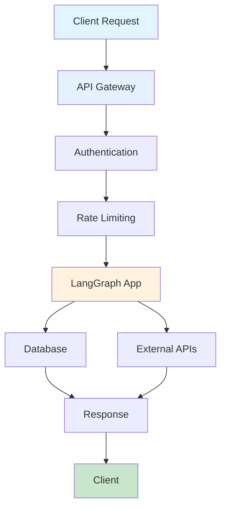

### 2. Microservices Architecture

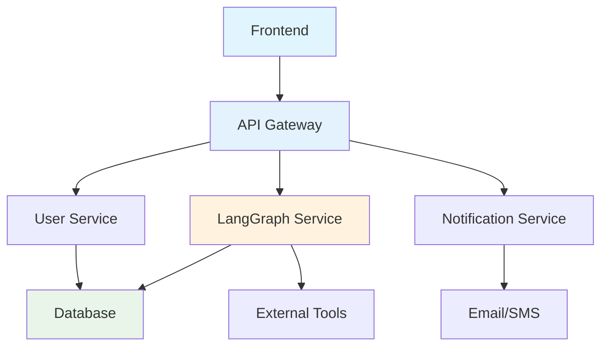

### 3. Event-Driven Architecture

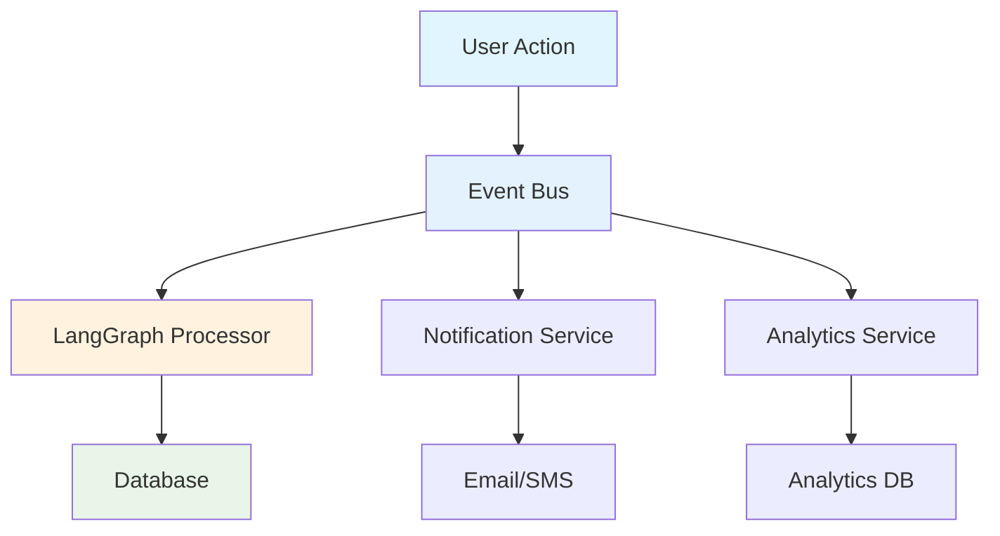

## Performance Optimization

### 1. Caching Strategy

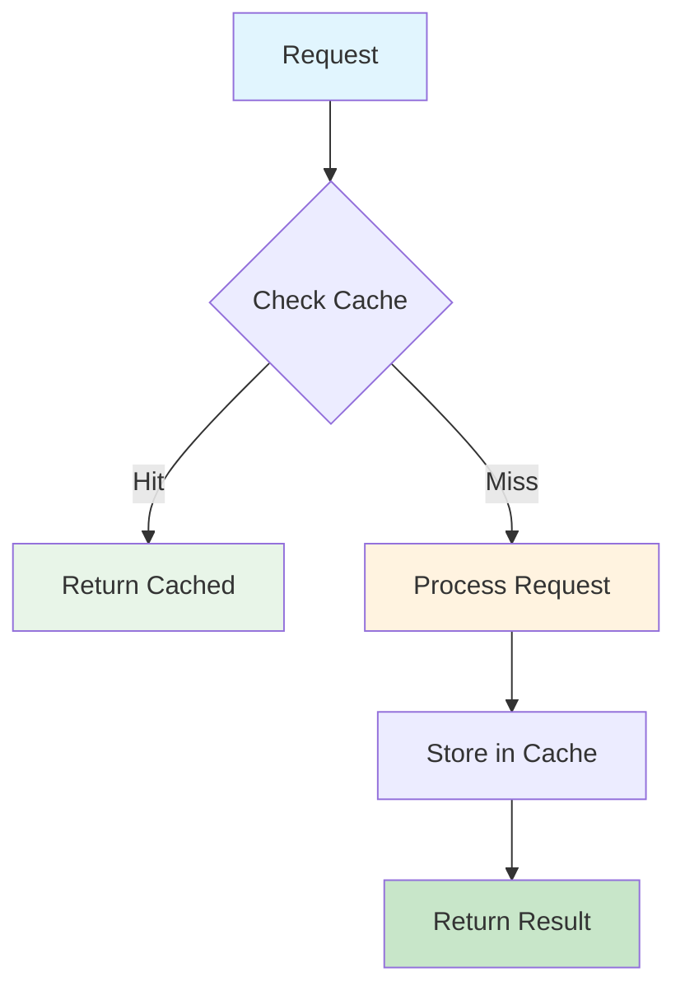

### 2. Load Balancing

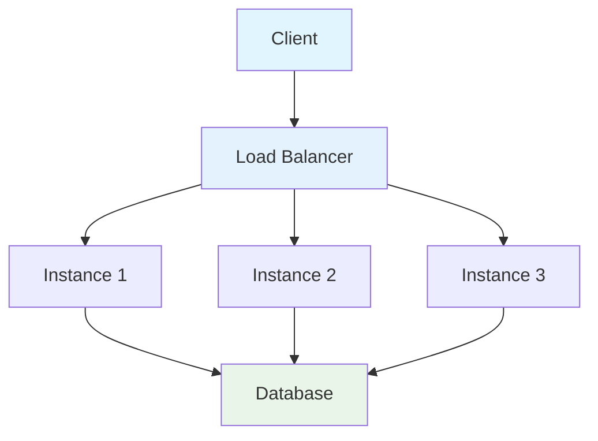

## Monitoring and Observability

### 1. Metrics Collection

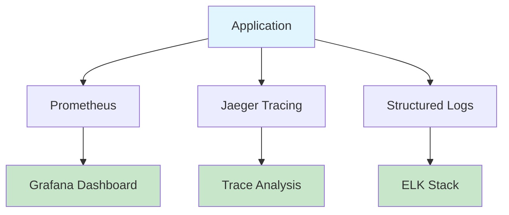

### 2. Alerting System

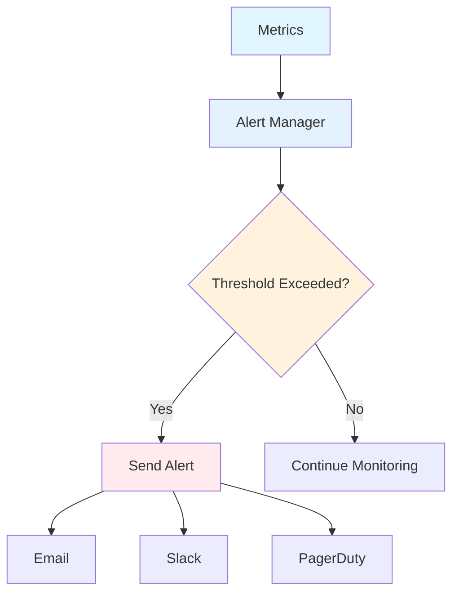

## Deployment Strategies

### 1. Container Deployment

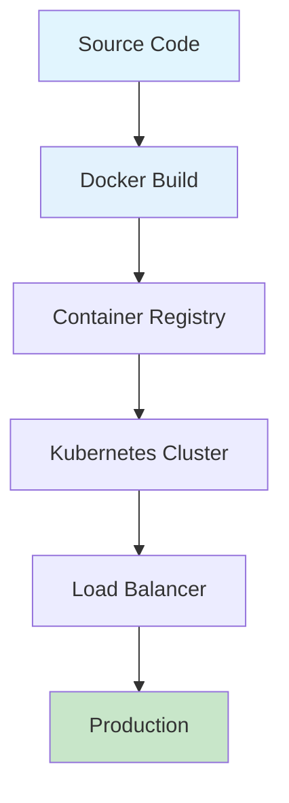

### 2. Blue-Green Deployment

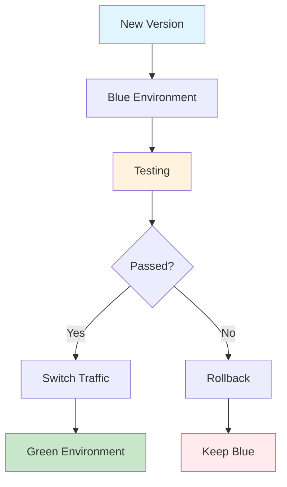

## Key Takeaways

### What You've Learned
- **Real-World Applications**: How to apply LangGraph to actual business problems
- **System Integration**: Patterns for integrating with existing infrastructure
- **Performance Optimization**: Strategies for scaling and optimizing applications
- **Production Deployment**: Best practices for deploying to production

### Next Steps
- **Custom Applications**: Build your own LangGraph applications
- **Advanced Integration**: Integrate with your existing systems
- **Performance Tuning**: Optimize for your specific use case
- **Production Monitoring**: Implement comprehensive observability

### Best Practices
- **Modular Design**: Build reusable components
- **Error Handling**: Implement robust error handling
- **Security**: Follow security best practices
- **Testing**: Comprehensive testing strategies
- **Documentation**: Maintain clear documentation

## Troubleshooting

### Common Issues

**Issue**: "Integration with external systems"
- **Solution**: Use proper API patterns and error handling

**Issue**: "Performance bottlenecks"
- **Solution**: Implement caching and optimization strategies

**Issue**: "Deployment complexity"
- **Solution**: Use containerization and CI/CD pipelines

### Debugging Tips

```python
# Add comprehensive logging
import logging

logging.basicConfig(level=logging.INFO)
logger = logging.getLogger(__name__)

def debug_real_world_app(state: dict, app_name: str):
    """Debug real-world application execution."""
    logger.info(f"Application: {app_name}")
    logger.info(f"State keys: {list(state.keys())}")
    logger.info(f"Next action: {state.get('next', 'unknown')}")
    logger.info("-" * 50)

# Enhanced execution with debugging
def safe_real_world_execution(app_func, state: dict, app_name: str):
    """Execute real-world application with debugging and error handling."""
    try:
        debug_real_world_app(state, app_name)
        result = app_func(state)
        logger.info(f"Application {app_name} completed successfully")
        return result
    except Exception as e:
        logger.error(f"Application {app_name} failed: {e}")
        return state  # Return original state on error
```

## Try It Yourself!

**Interactive Challenge**: Build a healthcare appointment scheduling system that:
1. Handles appointment booking and rescheduling
2. Integrates with medical records systems
3. Provides automated reminders
4. Ensures HIPAA compliance

<details>
<summary>Starter Template</summary>

```python
class HealthcareState(TypedDict):
    patient_id: Annotated[str, "Patient ID"]
    appointment_type: Annotated[str, "Type of appointment"]
    preferred_date: Annotated[str, "Preferred appointment date"]
    medical_records: Annotated[dict, "Patient medical records"]
    available_slots: Annotated[list, "Available appointment slots"]
    scheduled_appointment: Annotated[dict, "Scheduled appointment details"]
    compliance_status: Annotated[str, "HIPAA compliance status"]
    next: Annotated[str, "Next action"]

class AppointmentScheduler:
    def schedule_appointment(self, state: HealthcareState) -> HealthcareState:
        """Schedule a healthcare appointment."""
        # Your appointment scheduling logic here
        pass

class MedicalRecordsIntegrator:
    def fetch_medical_records(self, patient_id: str) -> dict:
        """Fetch patient medical records."""
        # Your medical records integration logic here
        pass
```
</details>

---

**Congratulations!** You've completed the comprehensive LangGraph tutorial series. You now have the knowledge and skills to build sophisticated, production-ready applications with LangGraph! 