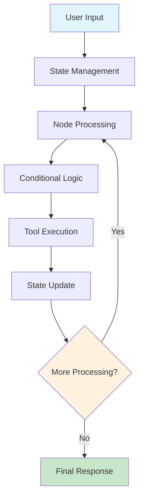
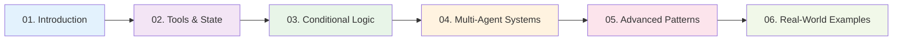
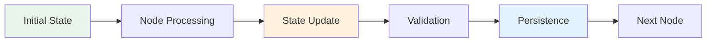
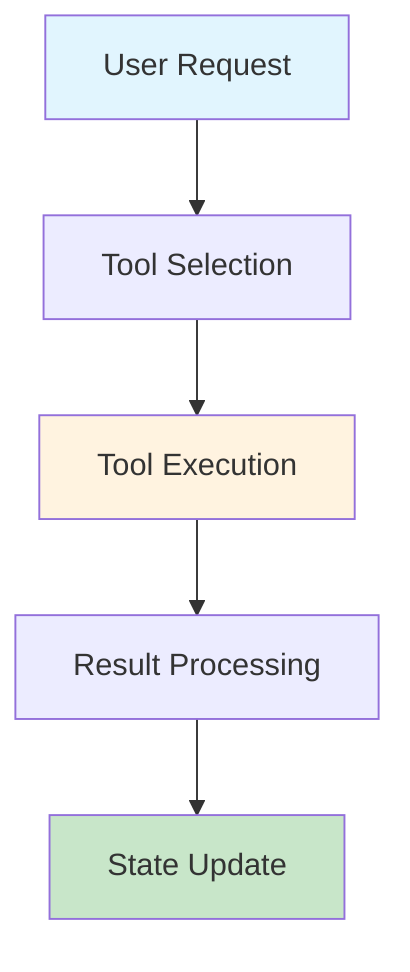
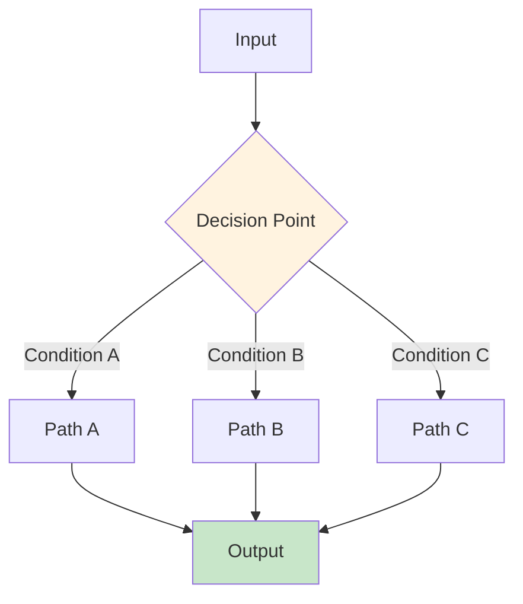
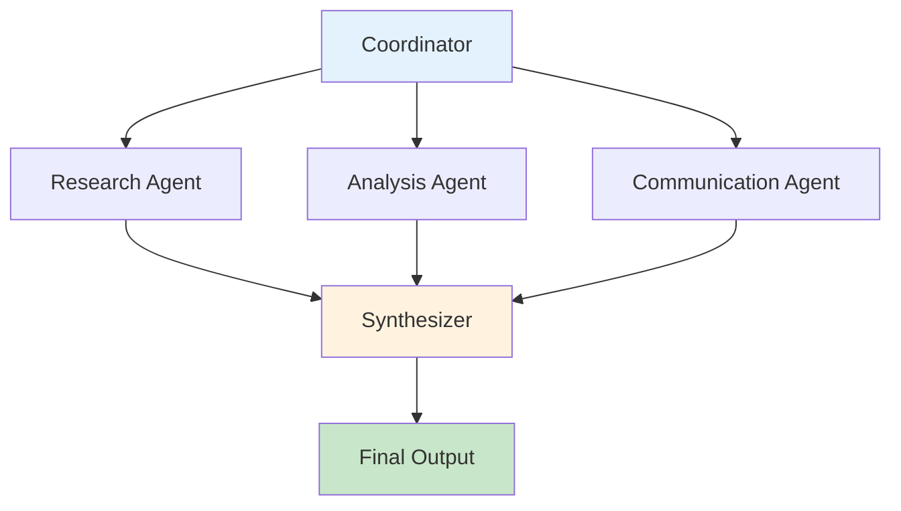
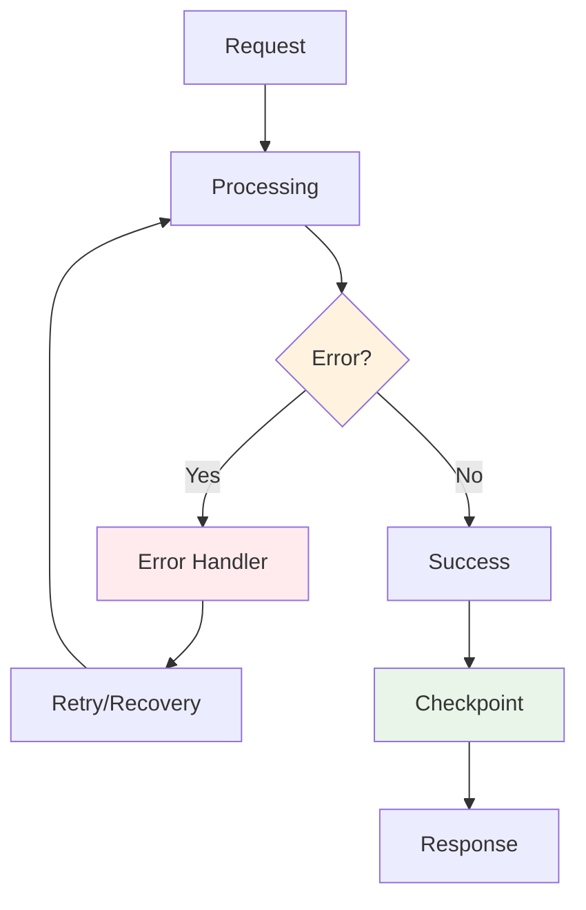
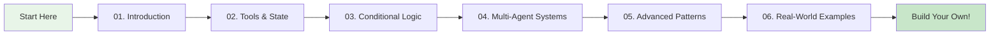

# LangGraph Tutorial Series

Welcome to the comprehensive LangGraph tutorial series! This collection of tutorials will guide you through building sophisticated, stateful applications with LangGraph, from basic concepts to advanced patterns.

## What is LangGraph?

LangGraph is a library for building stateful, multi-actor applications with LLMs. It extends the LangChain ecosystem by providing a framework for creating complex workflows that can handle state management, conditional logic, and multi-agent interactions.

### How LangGraph Works



### LangGraph vs Traditional LangChain

| Feature | Traditional LangChain | LangGraph |
|---------|----------------------|-----------|
| **State Management** | Limited | Full state persistence |
| **Workflow Control** | Linear chains | Complex conditional logic |
| **Multi-Agent** | Difficult | Native support |
| **Human-in-the-Loop** | Manual | Built-in interrupts |
| **Parallel Processing** | Limited | Native support |
| **Error Recovery** | Basic | Advanced patterns |

## Tutorial Structure

This tutorial series is designed to take you from beginner to advanced LangGraph developer. Each tutorial builds upon the previous ones, providing hands-on examples and practical applications.

### Learning Path



### Detailed Tutorial Overview

#### 1. [Introduction to LangGraph](./01-introduction-to-langgraph.md)
   - **What you'll learn**: Basic concepts, setup, and your first LangGraph app
   - **Key concepts**: State management, nodes, edges, graph compilation
   - **Hands-on**: Simple chat bot with state persistence
   - **Interactive**: Live code examples and step-by-step walkthrough

#### 2. [Tools and State Management](./02-tools-and-state.md)
   - **What you'll learn**: Building custom tools and managing complex state
   - **Key concepts**: Tool creation, state patterns, persistence
   - **Hands-on**: Customer support bot with database integration
   - **Interactive**: Tool building exercises and state debugging

#### 3. [Conditional Logic and Routing](./03-conditional-logic.md)
   - **What you'll learn**: Dynamic workflows and intelligent routing
   - **Key concepts**: Conditional edges, routing logic, multi-path workflows
   - **Hands-on**: Travel booking system with specialized agents
   - **Interactive**: Routing decision trees and flow visualization

#### 4. [Multi-Agent Systems](./04-multi-agent-systems.md)
   - **What you'll learn**: Building systems with multiple specialized agents
   - **Key concepts**: Agent specialization, communication patterns, coordination
   - **Hands-on**: Content creation system with research, writing, and editing agents
   - **Interactive**: Agent interaction diagrams and role-playing scenarios

#### 5. [Advanced Patterns](./05-advanced-patterns.md)
   - **What you'll learn**: Production-ready patterns and best practices
   - **Key concepts**: Interrupts, checkpoints, error handling, integration
   - **Hands-on**: Robust application with human-in-the-loop capabilities
   - **Interactive**: Error simulation and recovery exercises

#### 6. [Real-World Examples](./06-practical-examples.md)
   - **What you'll learn**: Applying LangGraph to real business problems
   - **Key concepts**: Industry-specific patterns, compliance, scalability
   - **Hands-on**: E-commerce, content moderation, and financial advisory bots
   - **Interactive**: Industry case studies and solution design workshops

## Quick Start

### Prerequisites

Before starting the tutorials, ensure you have the following installed:

```bash
# Core dependencies
pip install -U langgraph langchain-community langchain-anthropic

# Additional tools
pip install tavily-python pandas openai

# Optional: For advanced examples
pip install sqlite3 requests numpy
```

### Environment Setup

Set up your API keys securely:

```python
import getpass
import os

def _set_env(var: str):
    """Securely set environment variables."""
    if not os.environ.get(var):
        os.environ[var] = getpass.getpass(f"{var}: ")

# Required API keys
_set_env("ANTHROPIC_API_KEY")  # For Claude models
_set_env("OPENAI_API_KEY")     # For GPT models (alternative)
_set_env("TAVILY_API_KEY")     # For web search (optional)
```

### Your First LangGraph Application

Here's a simple example to get you started:

```python
from typing import TypedDict, Annotated
from langgraph.graph import StateGraph, END
from langchain_anthropic import ChatAnthropic
from langchain_core.messages import HumanMessage

# Define the state structure
class ChatState(TypedDict):
    messages: Annotated[list, "The messages in the conversation"]
    user_name: Annotated[str, "User's name"]
    conversation_count: Annotated[int, "Number of conversations"]

# Create the LLM
llm = ChatAnthropic(model="claude-3-sonnet-20240229")

# Define the chat node
def chat_node(state: ChatState) -> ChatState:
    """Process user message and generate response."""
    messages = state["messages"]
    
    # Add conversation context
    context_message = f"User: {state['user_name']}, Conversation #{state['conversation_count']}"
    
    # Generate response
    response = llm.invoke([HumanMessage(content=context_message)] + messages)
    
    return {
        **state,
        "messages": messages + [response],
        "conversation_count": state["conversation_count"] + 1
    }

# Create the graph
workflow = StateGraph(ChatState)

# Add nodes and edges
workflow.add_node("chat", chat_node)
workflow.set_entry_point("chat")
workflow.add_edge("chat", END)

# Compile the graph
app = workflow.compile()

# Use the application
result = app.invoke({
    "messages": [HumanMessage(content="Hello!")],
    "user_name": "Alice",
    "conversation_count": 1
})

print(f"Response: {result['messages'][-1].content}")
print(f"Conversation count: {result['conversation_count']}")
```

### Try It Yourself!

**Interactive Exercise**: Modify the above code to:
1. Add a greeting based on the time of day
2. Track the user's mood
3. Provide personalized responses

<details>
<summary>Solution</summary>

```python
from datetime import datetime

def enhanced_chat_node(state: ChatState) -> ChatState:
    """Enhanced chat node with time-based greetings and mood tracking."""
    messages = state["messages"]
    current_time = datetime.now().hour
    
    # Time-based greeting
    if 5 <= current_time < 12:
        greeting = "Good morning"
    elif 12 <= current_time < 17:
        greeting = "Good afternoon"
    else:
        greeting = "Good evening"
    
    # Enhanced context
    context_message = f"{greeting} {state['user_name']}! This is conversation #{state['conversation_count']}"
    
    response = llm.invoke([HumanMessage(content=context_message)] + messages)
    
    return {
        **state,
        "messages": messages + [response],
        "conversation_count": state["conversation_count"] + 1
    }
```
</details>

## Learning Objectives

By the end of this tutorial series, you will be able to:

### Core Understanding
- **Understand LangGraph fundamentals** and how they differ from traditional LangChain
- **Master state management** for complex, persistent conversations
- **Design effective tools** that extend your application's capabilities

### Technical Skills
- **Implement conditional logic** for dynamic workflow routing
- **Build multi-agent systems** with specialized capabilities
- **Handle advanced patterns** like interrupts, checkpoints, and error recovery
- **Integrate with external systems** and APIs seamlessly

### Production Readiness
- **Build production-ready applications** with proper error handling
- **Implement security best practices** and compliance requirements
- **Optimize performance** and scale applications effectively
- **Monitor and debug** complex workflows

## Key Concepts Covered

### State Management


- **TypedDict for state definition** - Type-safe state management
- **State persistence and validation** - Robust data handling
- **Context sharing between nodes** - Seamless information flow

### Tools and Integration


- **Custom tool creation** - Extend functionality with `@tool` decorator
- **External API integration** - Connect to third-party services
- **Database operations** - Persistent data storage

### Conditional Logic


- **Dynamic routing based on content** - Intelligent path selection
- **Time-based and priority-based routing** - Context-aware decisions
- **Multi-agent handoffs** - Seamless agent transitions

### Multi-Agent Systems


- **Specialized agent design** - Focused, expert agents
- **Agent communication patterns** - Effective collaboration
- **Parallel and sequential processing** - Optimized workflows

### Advanced Patterns


- **Interrupts and human-in-the-loop** - Human oversight capabilities
- **Checkpoints and state persistence** - Reliable execution
- **Error handling and circuit breakers** - Robust applications
- **Performance optimization** - Scalable solutions

## Example Applications

Throughout the tutorials, you'll build several practical applications:

### E-commerce Customer Service Bot
- **Features**: Order tracking, returns processing, product recommendations
- **Techniques**: Intent classification, multi-agent routing, escalation handling
- **Real-world skills**: Customer service automation, business process integration

### Content Moderation System
- **Features**: Text analysis, inappropriate content detection, human review routing
- **Techniques**: Content analysis, confidence scoring, compliance checking
- **Real-world skills**: Content safety, regulatory compliance, automated moderation

### Financial Advisory Bot
- **Features**: Goal analysis, investment recommendations, retirement planning
- **Techniques**: Financial calculations, risk assessment, regulatory compliance
- **Real-world skills**: Financial services, compliance automation, personalized advice

### Content Creation System
- **Features**: Research, writing, editing, publishing workflow
- **Techniques**: Multi-agent collaboration, content optimization, quality assurance
- **Real-world skills**: Content automation, creative workflows, quality control

## Best Practices

The tutorials emphasize these best practices:

### Architecture
- **Modular Design** - Create reusable, focused components
- **Separation of Concerns** - Clear boundaries between agents and tools
- **Scalable Architecture** - Design for growth and performance

### Reliability
- **Error Handling** - Implement robust error recovery mechanisms
- **State Validation** - Ensure data integrity throughout the workflow
- **Circuit Breakers** - Prevent cascading failures

### Security & Compliance
- **Input Validation** - Sanitize and validate all inputs
- **Authentication & Authorization** - Secure access to sensitive operations
- **Audit Trails** - Maintain comprehensive logs for compliance

### Performance
- **Caching Strategies** - Optimize expensive operations
- **Parallel Processing** - Leverage concurrent execution where possible
- **Resource Management** - Efficient use of computational resources

## Getting Help

If you encounter issues or have questions:

### Resources
1. **Official Documentation**: [LangGraph Documentation](https://langchain-ai.github.io/langgraph/)
2. **GitHub Repository**: [LangGraph GitHub](https://github.com/langchain-ai/langgraph)
3. **Community Discord**: [LangChain Discord](https://discord.gg/langchain)

### Troubleshooting
- **Check the examples** in each tutorial
- **Experiment with the code** - modify examples to understand concepts better
- **Review error messages** - they often provide helpful debugging information
- **Use the interactive exercises** - they're designed to reinforce learning

## Prerequisites Knowledge

This tutorial series assumes you have:

### Python Fundamentals
- **Basic Python knowledge** (functions, classes, imports, decorators)
- **Understanding of async programming** (for advanced patterns)
- **Familiarity with type hints** (for state definitions)

### LangChain Basics
- **Familiarity with LangChain** (basic concepts like LLMs and chains)
- **Understanding of message types** (HumanMessage, AIMessage, etc.)
- **Knowledge of tool usage** (basic tool concepts)

### Web & APIs
- **Knowledge of web APIs** (for integration examples)
- **Understanding of HTTP requests** (for external service calls)
- **Basic database concepts** (for persistence examples)

## Next Steps

After completing this tutorial series:

### Immediate Actions
1. **Build your own application** using the patterns you've learned
2. **Experiment with different architectures** and see what works best
3. **Join the community** and share your projects

### Advanced Learning
1. **Explore the LangGraph ecosystem** - check out community examples
2. **Study production deployments** - learn from real-world implementations
3. **Contribute to the community** - share your learnings and improvements

### Future Directions
1. **Stay updated** - follow LangGraph releases and new features
2. **Explore related technologies** - vector databases, monitoring tools, etc.
3. **Consider certifications** - if available for LangGraph/LangChain

## License & Attribution

This tutorial series is provided as-is for educational purposes. The examples are based on the [official LangGraph customer support tutorial](https://langchain-ai.github.io/langgraph/tutorials/customer-support/customer-support/) and adapted for comprehensive learning.

### Acknowledgments
- **LangChain Team** - For creating and maintaining LangGraph
- **Community Contributors** - For examples and best practices
- **Open Source Community** - For the tools and libraries that make this possible

---

## Interactive Learning Path

**Ready to start your LangGraph journey?** 



**Begin with [Introduction to LangGraph](./01-introduction-to-langgraph.md)** and work your way through the series. Each tutorial includes:

- **Detailed explanations** with visual diagrams
- **Interactive exercises** to reinforce learning
- **Practical examples** you can run immediately
- **Step-by-step walkthroughs** of complex concepts
- **Real-world applications** you can adapt to your needs

**Happy coding!** 